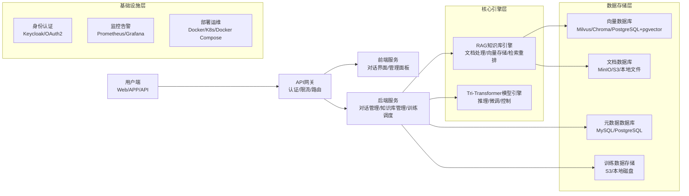

# 产品需求文档（PRD）：Tri-Transformer 可控对话与 RAG 知识库增强系统

## 1. 文档概述

### 1.1 产品名称

Tri-Transformer 可控对话与 RAG 知识库增强系统（简称：Tri-Transformer RAG 助手）

### 1.2 产品定位

一款融合**三分支 Transformer 扭合架构**（输入编码-控制中枢-输出生成）与**向量化文档知识库（RAG）的高端对话与内容生成系统。旨在为技术、商业、家庭育儿等多场景提供高可控、高精准、无幻觉**的智能助手，实现从文档知识库到自然语言输出的端到端闭环。

### 1.3 核心目标

1. 构建一套**可定制、可扩展**的三分支 Transformer 模型架构，实现对话上下文的深度理解、全局控制与受控生成。

2. 深度集成 RAG 文档知识库，确保生成内容**100% 贴合自有知识**，从根源解决大模型幻觉问题。

3. 支持**双端对话训练**（双大模型/人机），通过高质量语料微调，使模型具备领域适配能力与人类偏好对齐。

4. 提供**全流程开源技术栈**与**可视化部署方案**，降低落地门槛，支持个人与企业级应用。

### 1.4 目标用户

- **核心用户**：技术开发者（AI 工程师、系统架构师）、领域专家（企业顾问、医生、律师）、家庭管理者。

- **用户场景**：

    - 技术：构建私有 AI 助手、自动化文档生成、代码辅助。

    - 商业：市场分析、品牌文案、投资研究报告生成。

    - 家庭：育儿知识问答、家庭事务规划、家庭成员沟通辅助。

## 2. 需求背景与痛点

### 2.1 行业背景

- 大模型技术已广泛应用，但**通用模型**在领域知识适配、事实准确性、生成可控性方面存在固有缺陷。

- RAG（检索增强生成）成为解决知识库与事实问题的主流方案，但传统 RAG 与大模型之间存在**解耦**问题，检索精度与生成效果易脱节。

- 传统 Transformer 架构（Encoder-Decoder）在**长序列处理、多轮对话、全局约束**方面能力有限。

### 2.2 用户核心痛点

1. **幻觉问题**：通用大模型易编造信息，无法验证事实来源。

2. **可控性差**：生成内容偏离主题、不符合指令、风格不统一。

3. **知识滞后**：模型无法快速获取和更新私有知识库。

4. **定制成本高**：从零训练大模型成本高昂，难以适配个性化需求。

5. **技术门槛高**：RAG 系统搭建、模型微调、架构设计复杂，非技术用户难以落地。

### 2.3 产品解决方案

通过**三分支 Transformer 扭合架构**强化控制能力，通过**RAG 知识库**锚定事实，通过**开源技术栈**降低落地成本，完整解决上述痛点。

## 3. 产品功能需求

### 3.1 核心功能模块

#### 3.1.1 三分支 Transformer 模型模块

|模块名称|核心功能|关键特性|
|---|---|---|
|**I-Transformer（输入编码器）**|输入理解与表征|1. 接收用户输入、对话历史、RAG 检索知识； 2. 多粒度语义编码，支持长序列输入； 3. 动态注意力与残差调节，接收 C 分支控制。|
|**C-Transformer（控制中枢）**|全局调度与约束|1. 内置全局状态槽，管理任务指令与对话状态； 2. 双向交叉注意力，实时监控 I/O 分支状态； 3. 生成控制信号，约束 I 编码与 O 生成逻辑； 4. 知识一致性校验，抑制幻觉。|
|**O-Transformer（输出解码器）**|受控内容生成|1. 自回归生成，因果掩码防止未来信息泄露； 2. 交叉注意力融合 I 分支编码； 3. 接收 C 分支约束，确保内容贴合知识库与指令。|
#### 3.1.2 RAG 文档知识库模块

|模块名称|核心功能|关键特性|
|---|---|---|
|**文档管理与摄入**|多格式文档导入与处理|1. 支持 PDF、Word、Excel、PPT、Markdown、图片等格式； 2. 自动 OCR 识别扫描件； 3. 文档清洗、去重、格式标准化。|
|**文档分块与向量化**|知识片段化与语义转化|1. 支持固定窗口、语义、父子层级等多种分块策略； 2. 开源嵌入模型（BGE 系列）生成高维向量； 3. 向量与元数据绑定存储。|
|**向量存储与检索**|高效知识召回|1. 支持 HNSW、IVF_PQ 等主流索引； 2. 向量检索 + 关键词 BM25 混合检索； 3. 元数据过滤（权限、时间、文档类型）； 4. 重排模型（BGE Reranker）提升精准度。|
|**知识更新与管理**|动态知识库维护|1. 增量更新（仅处理修改文档）； 2. 版本管理（支持历史版本回溯）； 3. 权限控制（多用户/多租户）。|
#### 3.1.3 对话训练与微调模块

|模块名称|核心功能|关键特性|
|---|---|---|
|**语料生成**|双端对话数据构建|1. 双大模型对话（冷启动生成大规模语料）； 2. 人机对话采集（高质量真实数据）； 3. 对话增强（同义改写、场景泛化）。|
|**数据标注与预处理**|训练数据结构化|1. 标注对话质量、知识依赖、偏好； 2. 标准化样本格式（指令、历史、查询、知识、目标回复、控制标签）； 3. 数据集划分与验证集构建。|
|**模型训练**|三分支分阶段微调|1. 阶段 1：I/O 分支基础对话能力微调（LoRA）； 2. 阶段 2：C 分支控制中枢全量训练（控制对齐损失 + 知识一致性损失）； 3. 阶段 3：RAG 适配训练（拒答、事实绑定）； 4. 可选：DPO 人类偏好对齐。|
|**模型管理**|版本与部署|1. 模型版本管理； 2. 推理部署（API 服务、本地部署）； 3. 性能监控（响应时间、准确率、幻觉率）。|
#### 3.1.4 对话交互与应用模块

|模块名称|核心功能|关键特性|
|---|---|---|
|**对话界面**|用户交互入口|1. 支持单轮/多轮对话； 2. 实时显示检索知识来源（可追溯）； 3. 对话历史保存与导出； 4. 支持文档上传直接提问。|
|**结果后处理**|输出优化与校验|1. 事实一致性校验； 2. 格式标准化（排版、引用）； 3. 错误修正（幻觉、知识错误）。|
|**可视化管理**|系统配置与监控|1. RAG 知识库管理界面（文档上传、删除、检索测试）； 2. 模型训练状态监控； 3. 性能指标可视化（检索准确率、生成 BLEU 分数、幻觉率）。|
### 3.2 非功能需求

#### 3.2.1 性能需求

- **检索速度**：单条查询检索响应时间 < 500ms（Top 10 结果）。

- **生成速度**：单条回复生成时间 < 2s（1024 token 输出）。

- **准确率**：RAG 检索精准率 > 90%，生成内容与知识库一致性 > 95%。

- **并发能力**：支持 10+ 并发用户同时对话。

#### 3.2.2 可靠性需求

- 系统全年可用性 > 99.9%。

- 数据持久化，支持定期备份与恢复。

- 模型推理失败时提供友好提示，自动重试。

#### 3.2.3 安全性需求

- 文档与对话数据加密存储，支持权限隔离。

- 支持用户身份认证（账号密码、SSO）。

- 禁止生成违法、违规、敏感内容。

#### 3.2.4 可扩展性需求

- 支持横向扩展向量数据库与模型推理服务。

- 支持接入第三方大模型（API 方式）作为 I/O 分支备选。

- 支持多租户架构，企业级数据隔离。

#### 3.2.5 易用性需求

- 提供可视化 Web 界面，非技术用户可快速上手。

- 命令行工具与 API 文档完善，支持技术用户二次开发。

- 部署流程自动化，支持 Docker Compose 一键部署。

## 4. 技术架构设计

### 4.1 整体架构图

### 4.2 技术栈选型

|层级|技术选型|说明|
|---|---|---|
|**前端**|React + Ant Design Pro|构建高性能、可扩展的可视化界面，适配对话交互与系统管理面板，组件化开发提升复用性与维护性。|
|**后端**|FastAPI / Python|高性能 API 框架，适配 AI 模型推理与数据处理。|
|**RAG 引擎**|LlamaIndex / LangChain|编排文档处理、检索、生成流程，支持多策略扩展。|
|**向量数据库**|Milvus（企业）/ Chroma（个人）|高性能向量存储，支持分布式与单机部署，HNSW 索引。|
|**嵌入模型**|BGE 系列（bge-large-zh-v1.5）|开源中文语义嵌入模型，精准度高，适配 RAG 场景。|
|**重排模型**|BGE Reranker Large|提升检索精准度，解决语义偏移问题。|
|**模型训练**|PyTorch / Hugging Face Transformers / PEFT（LoRA）/ DeepSpeed|分布式训练框架，支持大模型微调，降低显存消耗。|
|**文档处理**|Unstructured / PyMuPDF / PaddleOCR|多格式文档解析，OCR 识别图片文本。|
|**部署**|Docker / Docker Compose|容器化部署，一键启动所有服务。|
|**监控**|Prometheus + Grafana|监控系统性能、模型指标、资源使用情况。|
### 4.3 模型训练流程

1. **数据准备**：双大模型对话生成 → 人机对话标注 → 数据清洗与增强 → 结构化样本生成。

2. **预训练权重加载**：I 分支加载 BERT/RoBERTa，O 分支加载 Llama/Qwen，C 分支随机初始化。

3. **阶段 1 微调**：I/O 分支 LoRA 微调，学习基础对话能力（交叉熵损失）。

4. **阶段 2 微调**：C 分支全量训练，学习控制对齐与知识一致性（控制损失 + 知识损失）。

5. **阶段 3 微调**：RAG 适配训练，学习拒答与事实绑定。

6. **偏好对齐**：DPO 微调，优化人类偏好与回复质量。

7. **模型导出**：导出推理权重，部署到推理服务。

### 4.4 推理流程

1. 用户输入查询 → 对话历史拼接。

2. RAG 引擎检索相关知识（向量 + 关键词 + 重排）。

3. 输入预处理：融合指令、历史、查询、检索知识。

4. Tri-Transformer 推理：

    - I 分支编码输入与知识。

    - C 分支生成控制信号，约束编码与生成。

    - O 分支受控生成回复。

5. 后处理：事实校验 → 格式优化 → 返回用户。

6. 对话沉淀：高质量对话回写知识库，用于后续更新。

## 5. 产品路线图

### 5.1 第一阶段：MVP 版本（1-2 个月）

- **核心功能**：

    1. 基础 RAG 知识库搭建（文档上传、固定分块、BGE 嵌入、Chroma 存储）。

    2. 简化版 Tri-Transformer 模型（小参数，I/O 分支 LoRA 微调）。

    3. 基础对话界面（支持单轮对话、文档上传提问）。

    4. 一键部署脚本（Docker Compose）。

- **目标用户**：技术开发者、个人用户。

- **验收标准**：能成功搭建知识库，完成基础问答，无明显幻觉。

### 5.2 第二阶段：功能完善版本（2-3 个月）

- **核心功能**：

    1. 高级 RAG 功能（语义分块、父子分块、BM25 混合检索、重排模型）。

    2. 完整三分支 Tri-Transformer 架构（C 分支控制能力）。

    3. 双端对话训练工具（双大模型对话生成、数据标注界面）。

    4. 可视化管理面板（知识库管理、模型训练监控）。

    5. 支持多格式文档（PDF、图片 OCR）。

- **目标用户**：领域专家、中小企业。

- **验收标准**：生成内容精准贴合知识库，支持多轮对话，可控性强。

### 5.3 第三阶段：企业级版本（3-4 个月）

- **核心功能**：

    1. 分布式部署（K8s 支持、多租户、高可用）。

    2. 高级权限管理（细粒度角色控制、数据隔离）。

    3. 模型版本管理与 A/B 测试。

    4. 性能优化（批量推理、缓存机制、向量数据库集群）。

    5. 第三方大模型接入（API 方式替换 I/O 分支）。

- **目标用户**：大型企业、政府机构。

- **验收标准**：支持 100+ 并发，数据安全隔离，性能稳定。

### 5.4 第四阶段：迭代优化版本（持续）

- **核心功能**：

    1. 模型自动微调（基于用户反馈自动更新模型）。

    2. 多模态支持（语音、视频输入输出）。

    3. 知识库智能更新（自动挖掘高频问题，补充知识）。

    4. 行业定制模板（医疗、法律、教育等领域预设配置）。

- **目标用户**：全量用户。

- **验收标准**：用户反馈持续优化，覆盖更多细分场景。

## 6. 运营与维护

### 6.1 数据运营

- 收集用户对话数据，分析高频问题与知识缺口，指导知识库更新。

- 监控幻觉率、检索准确率、生成质量，持续优化模型与 RAG 策略。

### 6.2 系统维护

- 定期备份向量数据库、文档与元数据。

- 监控服务器资源（CPU、内存、GPU），自动扩容。

- 定期更新嵌入模型、重排模型与大模型权重，获取最新能力。

### 6.3 技术支持

- 提供文档中心、API 文档、FAQ 帮助用户快速上手。

- 建立社区/技术支持群，解决部署与使用问题。

## 7. 附录

### 7.1 术语表

- **Tri-Transformer**：三分支扭合架构，包含输入编码器（I）、控制中枢（C）、输出解码器（O）。

- **RAG**：检索增强生成（Retrieval-Augmented Generation），结合知识库检索与大模型生成。

- **向量数据库
> （注：文档部分内容可能由 AI 生成）