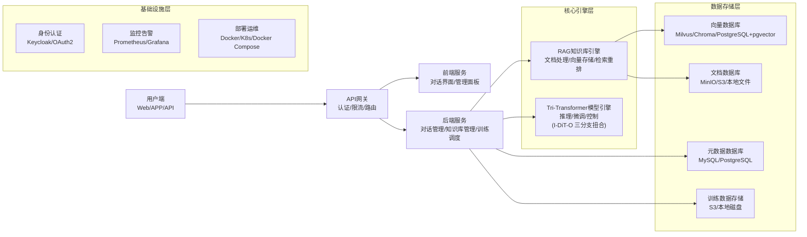

# 产品需求文档（PRD）：Tri-Transformer 可控对话与 RAG 知识库增强系统

## 1. 文档概述

### 1.1 产品名称

Tri-Transformer 可控对话与 RAG 知识库增强系统（简称：Tri-Transformer RAG 助手）

### 1.2 产品定位

一款融合**三分支 Transformer 深度扭合创新架构**（正向输入编码器 - DiT 控制中枢 - 反向输出解码器）与**向量化文档知识库（RAG）**的高端对话与内容生成系统。旨在为技术、商业、家庭育儿等多场景提供高可控、高精准、无幻觉的智能助手，实现从文档知识库到自然语言输出的端到端闭环。

### 1.3 核心目标

1. 构建一套**创新的三分支深度扭合 Transformer 模型架构**，实现对话上下文的深度理解、全局控制与受控生成。其核心创新在于：左端用户侧正向 Encoder-Decoder、中间 DiT 生成式控制架构、右端知识库侧反向 Decoder-Encoder 三者扭合贯通，形成「输入-控制-输出」闭合环路。

2. 深度集成 RAG 文档知识库，确保生成内容**100% 贴合自有知识**，从根源解决大模型幻觉问题。

3. 支持**双端对话训练**（训练时左/右端可接入两种不同大模型），通过高质量语料微调，使模型具备领域适配能力与人类偏好对齐。

4. 提供**全流程开源技术栈**与**可视化部署方案**，降低落地门槛，支持个人与企业级应用。

### 1.4 目标用户

- **核心用户**：技术开发者（AI 工程师、系统架构师）、领域专家（企业顾问、医生、律师）、家庭管理者。

- **用户场景**：

    - 技术：构建私有 AI 助手、自动化文档生成、代码辅助。

    - 商业：市场分析、品牌文案、投资研究报告生成。

    - 家庭：育儿知识问答、家庭事务规划、家庭成员沟通辅助。

---

## 2. 需求背景与痛点

### 2.1 行业背景

- 大模型技术已广泛应用，但**通用模型**在领域知识适配、事实准确性、生成可控性方面存在固有缺陷。

- RAG（检索增强生成）成为解决知识库与事实问题的主流方案，但传统 RAG 与大模型之间存在**解耦**问题，检索精度与生成效果易脱节。

- 传统 Transformer 架构（Encoder-Decoder）在**长序列处理、多轮对话、全局约束**方面能力有限。

- 2023-2025 年 Transformer 架构研究持续演进：DiT（Diffusion Transformer）在生成控制领域取得突破，Mamba/SSM 混合架构提升长序列效率，GQA/MLA 降低 KV Cache 压力，FlashAttention-3 大幅提速，RoPE 位置编码成为主流——这些进展为 Tri-Transformer 的架构设计提供了坚实的技术基础。

### 2.2 用户核心痛点

1. **幻觉问题**：通用大模型易编造信息，无法验证事实来源。

2. **可控性差**：生成内容偏离主题、不符合指令、风格不统一。

3. **知识滞后**：模型无法快速获取和更新私有知识库。

4. **定制成本高**：从零训练大模型成本高昂，难以适配个性化需求。

5. **技术门槛高**：RAG 系统搭建、模型微调、架构设计复杂，非技术用户难以落地。

### 2.3 产品解决方案

通过**三分支 Transformer 深度扭合架构**强化控制能力，通过**RAG 知识库**锚定事实，通过**开源技术栈**降低落地成本，完整解决上述痛点。

---

## 3. 核心模型架构设计（Model Skeleton）

> 本章为本项目核心创新，详细阐述 Tri-Transformer 架构设计理念、组件结构、数据流与训练策略。

### 3.1 架构总览：三分支深度扭合

Tri-Transformer 的核心思想是将三个功能异构的 Transformer 模块**扭合（Tightly Coupled）**为一个端到端的可微整体，而非松散的 Pipeline 拼接。

```
【用户端】                    【核心架构】                       【知识库端】
                   ┌──────────────────────────────────┐
用户输入 ──►  I-Transformer  ◄──►  C-Transformer  ◄──►  O-Transformer  ──► 生成输出
           （正向 Enc-Dec）      （DiT 控制中枢）      （反向 Dec-Enc）
           左端：可接大模型 A                         右端：可接大模型 B
                   └──────────────────────────────────┘
                                ▲
                                │ RAG 知识库检索注入
                                ▼
                         知识库（向量数据库）
```

**整体拓扑**：
- 模型**左端**（用户侧）：I-Transformer，正向 Encoder-Decoder，负责实时输入理解
- 模型**中间**（控制核心）：C-Transformer，DiT 架构的生成式控制中枢，负责全局调度
- 模型**右端**（知识库侧）：O-Transformer，反向 Decoder-Encoder（Decoder 模块在前），负责实时输出生成
- 训练时，左/右端可插接两种不同的预训练大模型，分别承担输入理解与输出生成的语言建模能力

### 3.2 I-Transformer：正向输入编码器

#### 3.2.1 设计理念

I-Transformer 位于模型**左端**（用户侧），采用**正向 Encoder-Decoder** 架构。Encoder 部分对用户输入、对话历史及 RAG 检索知识进行双向全局语义编码；Decoder 部分将编码结果转化为适配控制中枢的中间表征，实现信息从用户侧向控制层的高保真传递。

#### 3.2.2 架构组件

| 组件 | 实现方式 | 说明 |
|---|---|---|
| **Token 嵌入** | `nn.Embedding` + 缩放 `√d_model` | 词表大小 32000，维度 512 |
| **位置编码** | RoPE（旋转位置嵌入） | 替代传统 Sin-Cos PE，支持相对位置外推，适配长序列；参考 LLaMA/Qwen 实践 |
| **自注意力** | Multi-Head Self-Attention（MHSA） + FlashAttention-2/3 | 双向全注意力（Encoder）；因果掩码自注意力（Decoder）；GQA（分组查询注意力）降低 KV Cache |
| **前馈网络** | SwiGLU FFN | 替代 ReLU-FFN，性能更优；`dim_feedforward = 4 × d_model` |
| **归一化** | Pre-LN（RMSNorm） | 训练稳定性优于 Post-LN；RMSNorm 计算效率高于 LayerNorm |
| **控制注入** | Additive Control Bias | 接收 C-Transformer 的控制信号，加性注入到隐层表征 |

#### 3.2.3 关键技术选型依据

- **RoPE**：支持位置插值（YaRN/LongRoPE）实现上下文长度扩展，已被 LLaMA2/3、Qwen2、Mistral 等主流模型采用（2023-2024）。
- **GQA（Grouped Query Attention）**：将多头查询与分组 KV 头解耦，在不损失性能的前提下显著减少 KV Cache 显存占用，适合长对话场景（Ainslie et al., 2023）。
- **SwiGLU**：`SwiGLU(x, W, V, b, c) = Swish(xW + b) ⊙ (xV + c)`，经 PaLM、LLaMA 验证优于传统 FFN。
- **FlashAttention-2/3**：IO-aware 注意力计算，通过分块计算与 SRAM 复用，将注意力计算速度提升 2-3x，内存使用从 O(n²) 降至 O(n)。

#### 3.2.4 层次结构（6 层 Encoder + 可选 Decoder）

```
Input Token IDs
    │
    ▼
[Token Embedding × √d_model]
    │
    ▼
[RoPE Positional Encoding]
    │
    ▼
┌─────────────────────────────────┐
│  Encoder Layer × N_i           │
│  ┌─────────────────────────┐   │
│  │ Pre-RMSNorm             │   │
│  │ GQA Self-Attention      │   │  ← 双向全局注意力
│  │ + Residual              │   │
│  │ Pre-RMSNorm             │   │
│  │ SwiGLU FFN              │   │
│  │ + Residual              │   │
│  │ + Control Signal Bias   │   │  ← C-Transformer 注入
│  └─────────────────────────┘   │
└─────────────────────────────────┘
    │
    ▼
i_enc: (B, src_len, d_model)  ──► C-Transformer & O-Transformer
```

### 3.3 C-Transformer：DiT 生成式控制中枢

#### 3.3.1 设计理念

C-Transformer 位于架构**中央**，借鉴 **DiT（Diffusion Transformer）** 的 adaLN-Zero 条件调制机制，实现对 I/O 两个分支的**全局约束与动态调度**。不同于 DiT 用于图像去噪的时间步条件化，C-Transformer 以**对话状态槽（State Slot）**作为"控制向量"，通过双向交叉注意力同时感知输入编码与输出历史，生成全局控制信号注入 I/O 分支。

C-Transformer 是三分支中唯一能**双向感知**并**主动干预**其他两个分支的模块，是 Tri-Transformer 架构可控性的核心来源。

#### 3.3.2 DiT adaLN-Zero 调制机制

DiT 论文（Peebles & Xie, 2023）提出用 adaLN-Zero 替代标准 LayerNorm，通过条件向量（如时间步 embedding）生成缩放（γ）与偏移（β）参数，对特征进行自适应调制。C-Transformer 将这一机制迁移到语言控制域：

```
# 标准 adaLN-Zero 调制
adaLN_zero(x, c) = scale × LayerNorm(x) + shift
    where [scale, shift, gate] = Linear(silu(Linear(c)))

# C-Transformer 对话控制调制
ctrl_signal = adaLN_modulate(state_slot, context_emb)
```

```
                   ┌─────────────────────────────────────────┐
                   │         C-Transformer (DiT-style)       │
                   │                                         │
  i_enc ──────────►│ Cross-Attn-I  ←── state_slot           │
                   │     │              (对话状态槽)           │
  o_prev ──────────►│ Cross-Attn-O       │                   │
                   │                    ▼                    │
                   │              adaLN-Zero 调制             │
                   │              (scale / shift / gate)     │
                   │                    │                    │
                   │              Self-Attention             │
                   │                    │                    │
                   │              SwiGLU FFN                 │
                   │                    │                    │
                   └────────────────────┼────────────────────┘
                                        ▼
                              ctrl_signal (B, 1, d_model)
                              ┌──────────────────────────┐
                              │  注入 I-Transformer       │ (additive bias)
                              │  注入 O-Transformer       │ (adaLN scale/shift)
                              └──────────────────────────┘
```

#### 3.3.3 架构组件

| 组件 | 实现方式 | 说明 |
|---|---|---|
| **状态槽** | 可学习参数 `nn.Parameter(1, 1, d_model)` | 全局对话状态载体，训练中习得控制先验 |
| **自注意力** | MHSA（全局状态自注意力） | 状态槽内部信息整合 |
| **I 侧交叉注意力** | `Q=state_slot, KV=i_enc` | 感知输入编码，提取任务意图 |
| **O 侧交叉注意力** | `Q=state_slot, KV=o_prev` | 感知已生成输出，维护一致性 |
| **adaLN-Zero 调制** | `Linear(SiLU(Linear(ctrl)))` → `[scale, shift, gate]` | 生成对 I/O 分支的动态调制参数 |
| **FFN** | SwiGLU | 非线性控制特征提取 |
| **归一化** | Pre-RMSNorm | 与 I/O 分支统一 |

#### 3.3.4 控制信号传播机制

```
C-Transformer 输出 ctrl_signal：

  → 注入 I-Transformer：additive bias（i_hidden += ctrl_proj(ctrl_signal)）
  → 注入 O-Transformer：
      (1) adaLN-Zero scale/shift 调制每层 LayerNorm
      (2) 拼接到 memory（memory_with_ctrl = cat[i_enc, ctrl_proj(ctrl_signal)]）
```

控制信号以**加性偏置（Additive Bias）**与**自适应归一化调制（adaLN）**两种方式同时作用，分别影响编码阶段的语义表征与解码阶段的生成分布。

### 3.4 O-Transformer：反向输出解码器

#### 3.4.1 设计理念

O-Transformer 位于模型**右端**（知识库侧），采用**反向 Decoder-Encoder** 架构，即 **Decoder 模块在前，Encoder 模块在后**。

- **Decoder 在前**：执行受控自回归生成，通过因果掩码自注意力进行自回归 token 预测，同时通过交叉注意力融合 I-Transformer 的编码与 C-Transformer 的控制信号；
- **Encoder 在后**（反向编码层）：对已生成的输出序列进行**全局双向语义建模**，生成 `o_prev` 反馈至 C-Transformer，形成**输出→控制→输入**的闭合反馈环路。这是与传统 Seq2Seq 架构的关键区别。

#### 3.4.2 反向 Decoder-Encoder 架构意义

传统 Encoder-Decoder（BERT-GPT 范式）信息流是单向的：`Encoder(输入) → Decoder(输出)`。O-Transformer 的反向设计引入**输出侧的双向自省（Self-Reflection）能力**：

1. Decoder 层：生成当前 token，受 I 编码与 C 控制约束；
2. Encoder 层（反向）：对已生成序列全局建模，计算输出一致性表征 `o_prev`；
3. `o_prev` 反馈至 C-Transformer，使控制中枢能感知输出质量，动态调整后续生成策略。

```
Output Token IDs (tgt)
    │
    ▼
[Token Embedding × √d_model]
    │
    ▼
[RoPE Positional Encoding]
    │
    ▼
┌──────────────────────────────────────────────┐
│  Decoder Layer × N_o（反向 O-Transformer 前段）│
│  ┌────────────────────────────────────────┐  │
│  │ Pre-RMSNorm                            │  │
│  │ Causal Masked Self-Attention (GQA)     │  │  ← 因果掩码，自回归生成
│  │ + Residual                             │  │
│  │ Pre-RMSNorm                            │  │
│  │ Cross-Attention（KV = [i_enc; ctrl]）   │  │  ← 融合 I 编码 + C 控制
│  │ + Residual                             │  │
│  │ Pre-RMSNorm                            │  │
│  │ SwiGLU FFN (adaLN-Zero modulated)      │  │  ← C 控制信号调制
│  │ + Residual                             │  │
│  └────────────────────────────────────────┘  │
└──────────────────────────────────────────────┘
    │
    ▼
┌──────────────────────────────────────────────┐
│  Encoder Layer × N_reflect（反向自省编码层）   │
│  ┌────────────────────────────────────────┐  │
│  │ Pre-RMSNorm                            │  │
│  │ Bidirectional Self-Attention           │  │  ← 全局双向建模输出序列
│  │ + Residual                             │  │
│  │ Pre-RMSNorm                            │  │
│  │ SwiGLU FFN                             │  │
│  │ + Residual                             │  │
│  └────────────────────────────────────────┘  │
└──────────────────────────────────────────────┘
    │         │
    ▼         ▼
logits      o_prev ──► C-Transformer（反馈控制）
(B, tgt_len, vocab)
```

#### 3.4.3 架构组件

| 组件 | 实现方式 | 说明 |
|---|---|---|
| **Token 嵌入** | `nn.Embedding` + `√d_model` 缩放 | 与 I-Transformer 共享词表，可选权重共享 |
| **因果自注意力** | Causal Masked GQA | 防止未来信息泄露，保证自回归正确性 |
| **交叉注意力** | `Q=tgt, KV=concat(i_enc, ctrl_proj(ctrl))` | 融合输入编码与控制信号 |
| **adaLN-Zero 调制** | C-Transformer 输出的 scale/shift 对 FFN 调制 | 控制生成分布 |
| **反向双向 Encoder** | Bidirectional MHSA（无因果掩码） | 对已生成输出全局建模，生成 `o_prev` 反馈 |
| **输出投影** | `nn.Linear(d_model, vocab_size, bias=False)` | 权重可与 embedding 共享（Tied Weights） |

### 3.5 三分支信息流与扭合机制

#### 3.5.1 前向推理数据流

```
用户查询 + 对话历史 + RAG 检索知识
         │
         ▼
  I-Transformer（正向 Enc-Dec）
         │  i_enc (B, src_len, d_model)
         ├──────────────────────────────────────►─┐
         │                                        │
         ▼                                        │
  C-Transformer（DiT 控制中枢）                   │
    ← 接收 i_enc（I 侧感知）                      │
    ← 接收 o_prev（O 侧反馈）                     │
         │  ctrl_signal (B, 1, d_model)            │
         ├──────────────────────────────────►─┐   │
         │ additive bias → I-Transformer       │   │
         │ adaLN scale/shift → O-Transformer   │   │
         │                                    │   │
         ▼                                    ▼   ▼
  O-Transformer（反向 Dec-Enc）               i_enc
    Decoder: tgt × [i_enc; ctrl] → logits
    Encoder: logits_hidden → o_prev
         │
         ▼
    生成 token（logits）
         │
         ▼
    反向 Encoder → o_prev → C-Transformer（下一步控制更新）
```

#### 3.5.2 扭合（Tight Coupling）的四种机制

| 机制 | 方向 | 实现 | 作用 |
|---|---|---|---|
| **前向语义传递** | I → C → O | `i_enc` 作为 C 交叉注意力的 KV；`i_enc` 作为 O 交叉注意力的 KV | 输入语义传导至输出 |
| **控制信号注入** | C → I、C → O | additive bias + adaLN-Zero | C 约束 I 编码方向与 O 生成分布 |
| **输出反馈回路** | O → C | `o_prev`（反向 Encoder 输出）作为 C O-侧交叉注意力的 KV | 已生成内容反哺控制决策 |
| **知识库锚定** | RAG → I | 检索知识拼接入 `src` 输入 | 将外部知识注入编码器，减少幻觉 |

### 3.6 与主流 Transformer 架构的对比与创新点

| 维度 | 标准 Encoder-Decoder（T5/BART） | Decoder-Only（GPT/LLaMA） | **Tri-Transformer（本项目）** |
|---|---|---|---|
| **架构范式** | 单向 Enc → Dec | 单一因果 Decoder | 正向 Enc-Dec + DiT 控制 + 反向 Dec-Enc |
| **控制机制** | 无显式控制层 | 无显式控制层 | DiT adaLN-Zero 控制中枢，全局约束 |
| **输出反馈** | 无 | 无 | 反向 Encoder 生成 `o_prev`，闭环反馈 |
| **知识注入** | 拼接式 | 拼接式 | RAG + 控制信号双通道注入 |
| **训练灵活性** | 固定架构 | 固定架构 | 左/右端可插接不同预训练大模型 |
| **幻觉抑制** | 依赖训练数据 | 依赖训练数据 | 知识一致性损失 + RAG 锚定双重保障 |
| **位置编码** | 绝对/相对 PE | RoPE | RoPE（统一，支持长上下文扩展） |
| **注意力效率** | 标准 MHA | GQA | GQA + FlashAttention-2/3 |

### 3.7 Transformer 架构前沿研究调研（2023-2025）

本节梳理与 Tri-Transformer 设计直接相关的前沿研究进展，作为架构选型的依据。

#### 3.7.1 DiT（Diffusion Transformer）架构

**来源**：Peebles & Xie, "Scalable Diffusion Models with Transformers", ICCV 2023

**核心贡献**：
- 用 Transformer 替代 U-Net 作为扩散模型的去噪骨干，证明 Transformer 在生成任务中的优越扩展性（Scaling Laws）
- 提出 **adaLN-Zero**：通过条件向量生成自适应 LayerNorm 的 scale/shift/gate，实现无侵入式条件控制
- 条件注入方式优先级：adaLN-Zero > Cross-Attention > In-Context Conditioning

**对 Tri-Transformer 的启发**：C-Transformer 直接借鉴 adaLN-Zero 机制，将对话状态向量替换时间步向量，实现对生成过程的语义级条件控制。DiT 的 scaling 特性也为 C-Transformer 的参数效率提供保障。

**相关进展**：
- **SD3/FLUX（2024）**：MMDiT 多模态 DiT，双流自注意力，进一步强化控制精度
- **DDT（2025）**：解耦低频语义编码与高频细节解码，为 I/O 分支分工提供参考

#### 3.7.2 高效注意力机制

| 技术 | 来源 | 要点 | 应用 |
|---|---|---|---|
| **FlashAttention-2** | Dao et al., 2023 | IO-aware 分块计算，2x 加速，O(n) 显存 | 全分支注意力计算 |
| **FlashAttention-3** | 2024 beta | H100 专项优化，异步 pipeline，3x 加速 | GPU 推理加速 |
| **GQA** | Ainslie et al., 2023 | 分组共享 KV head，降低 KV Cache 压力 | I/O 分支长序列支持 |
| **MLA（Multi-Head Latent Attention）** | DeepSeek V2/V3, 2024 | 低秩 KV 压缩，KV Cache 大幅压缩 | 可选优化替代 GQA |
| **Sliding Window Attention** | Mistral, 2023 | 局部滑窗 + 全局 sink token，适合超长序列 | 超长对话历史处理 |

#### 3.7.3 位置编码演进

| 技术 | 要点 | 现状 |
|---|---|---|
| **RoPE（Su et al., 2022）** | 旋转位置编码，相对位置外推能力强 | LLaMA/Qwen/Mistral 等主流模型标配 |
| **YaRN（2023）** | RoPE 上下文扩展，插值 + 外推混合 | 低成本将 4K 扩展至 128K |
| **LongRoPE（2024）** | 非均匀插值，保留短距离精度 | 1M token 超长上下文 |
| **ALiBi（2022）** | 注意力偏置，训练短推理长 | 部分架构仍在使用 |

**选型结论**：Tri-Transformer 统一采用 **RoPE** 位置编码，C-Transformer 因处理全局状态槽（长度为 1）无需位置编码，I/O 分支支持 YaRN 扩展以应对长对话。

#### 3.7.4 FFN 与归一化改进

| 技术 | 要点 | 选型 |
|---|---|---|
| **SwiGLU（Noam Shazeer, 2020）** | 门控线性单元，`Swish(xW) ⊙ (xV)`，优于 GeLU | ✅ 全分支采用 |
| **RMSNorm（Zhang & Sennrich, 2019）** | 去掉均值中心化，计算效率更高 | ✅ 替代 LayerNorm |
| **Pre-LN** | 归一化前置，梯度更稳定 | ✅ 全分支采用 |
| **MoE（Mixture of Experts）** | 稀疏激活 FFN，参数量大推理成本不增 | 🔲 大规模版本可选 |

#### 3.7.5 混合架构趋势（参考）

2024 年涌现 Transformer-SSM 混合架构：
- **Jamba（AI21 Labs, 2024）**：交错 Transformer 层与 Mamba SSM 层，兼顾注意力能力与线性序列建模效率
- **Zamba（2024）**：共享注意力层 + Mamba SSM，参数效率高
- **RWKV-6（2024）**：纯 RNN 架构，训练并行+推理线性，适合资源受限场景

**对 Tri-Transformer 的参考意义**：C-Transformer 的状态槽机制在功能上与 SSM 的隐状态有一定相似性，后续版本可探索将 C 分支的内部序列建模替换为 Mamba SSM 层，在保持控制能力的同时降低计算开销。

#### 3.7.6 RAG 前沿技术（2024-2025）

| 技术 | 来源 | 要点 |
|---|---|---|
| **Contextual Retrieval** | Anthropic, 2024 | 为每个 chunk 添加文档上下文前缀再嵌入，BM25+向量混合 |
| **Late Chunking** | 2024 | 先用长上下文模型整体编码，再按位置切块，保留全局语义 |
| **ColBERT/ColPali** | Stanford, 2024 | 后期交互（Late Interaction）精细化相似度计算 |
| **HyDE** | 2023 | 用 LLM 生成假设文档进行检索，提升召回率 |
| **GraphRAG** | Microsoft, 2024 | 构建知识图谱辅助 RAG，提升复杂推理能力 |

### 3.8 模型规格参数

#### 3.8.1 标准版（Standard）

| 参数 | I-Transformer | C-Transformer | O-Transformer |
|---|---|---|---|
| 层数 | 6（Enc）+ 2（Dec） | 4 | 6（Dec）+ 2（反向 Enc） |
| 维度 `d_model` | 512 | 512 | 512 |
| 注意力头数 | 8（GQA: 8Q/4KV） | 8 | 8（GQA: 8Q/4KV） |
| FFN 维度 | 2048 | 2048 | 2048 |
| 最大序列长度 | 2048 | — | 2048 |
| 参数量 | ~85M | ~25M | ~90M |
| **总参数量** | | **~200M** | |

#### 3.8.2 大型版（Large，面向生产）

| 参数 | I-Transformer | C-Transformer | O-Transformer |
|---|---|---|---|
| 层数 | 24（Enc）+ 4（Dec） | 12 | 24（Dec）+ 4（反向 Enc） |
| 维度 `d_model` | 4096 | 4096 | 4096 |
| 注意力头数 | 32Q/8KV（GQA） | 32 | 32Q/8KV（GQA） |
| FFN 维度 | 14336（SwiGLU） | 16384 | 14336（SwiGLU） |
| 最大序列长度 | 32768（YaRN） | — | 32768（YaRN） |
| **总参数量** | | **~13B（可对接 7B 大模型替换 I/O 分支）** | |

### 3.9 训练策略设计

#### 3.9.1 三阶段渐进式训练

**阶段 0：I/O 分支预训练权重加载**
- I-Transformer Encoder：加载 BERT/RoBERTa/BGE 权重（双向语言模型能力）
- O-Transformer Decoder：加载 LLaMA/Qwen/GPT 权重（自回归生成能力）
- C-Transformer：**随机初始化**（全新控制能力习得）
- 冻结 I/O 分支权重，单独预训练 C 分支的状态槽与交叉注意力

**阶段 1：基础对话能力微调（LoRA）**
- 解冻 I/O 分支，施加 LoRA 适配器（rank=16, alpha=32）
- 任务：标准语言模型损失（交叉熵）
- 数据：通用对话语料 + 领域语料

**阶段 2：控制对齐训练**
- C 分支全量训练（无 LoRA）
- 联合损失：`L = L_lm + λ₁·L_ctrl_align + λ₂·L_knowledge_consistency`
  - `L_ctrl_align`：控制信号与目标风格/指令的对齐损失
  - `L_knowledge_consistency`：生成内容与 RAG 检索知识的事实一致性损失

**阶段 3：RAG 适配训练**
- 三分支联合微调
- 数据：含 RAG 上下文的问答对
- 增加拒答损失（当知识库无相关信息时模型应拒绝生成）

**阶段 4（可选）：DPO 人类偏好对齐**
- 收集人类偏好标注
- Direct Preference Optimization（Rafailov et al., 2023）
- 无需显式奖励模型

#### 3.9.2 训练时双端大模型插接

训练时，Tri-Transformer 的左/右端可分别插接两种不同的预训练大模型：

```
【训练配置示例】
- 左端 I 分支：插接 BERT-Large 或 Qwen2-7B-Encoder（提供强语言理解能力）
- 右端 O 分支：插接 LLaMA3-8B 或 Qwen2-7B-Decoder（提供强语言生成能力）
- 中间 C 分支：随机初始化，端到端习得控制能力

推理时：
- 选项 A：使用完整 Tri-Transformer（含原始 I/O 分支）
- 选项 B：替换 I/O 分支为 API 接口的第三方大模型，C 分支独立部署
```

这种设计使 Tri-Transformer 具备**模型无关的控制迁移能力**：C 分支习得的控制先验可跨模型复用。

---

## 4. 产品功能需求

### 4.1 核心功能模块

#### 4.1.1 三分支 Transformer 模型模块

| 模块名称 | 核心功能 | 关键特性 |
|---|---|---|
| **I-Transformer（正向 Enc-Dec）** | 输入理解与表征 | 1. 接收用户输入、对话历史、RAG 检索知识；2. 双向全局语义编码（GQA + RoPE + SwiGLU）；3. 接收 C 分支控制信号（加性注入）；4. 正向 Decoder 生成适配控制层的中间表征。 |
| **C-Transformer（DiT 控制中枢）** | 全局调度与约束 | 1. 可学习状态槽，管理任务指令与对话状态；2. 双向交叉注意力，实时感知 I/O 分支状态；3. adaLN-Zero 调制生成控制信号；4. 知识一致性校验，抑制幻觉。 |
| **O-Transformer（反向 Dec-Enc）** | 受控内容生成 | 1. 因果掩码自回归生成；2. 交叉注意力融合 I 编码 + C 控制；3. 反向 Encoder 生成 `o_prev` 反馈至 C 分支；4. adaLN-Zero 接收 C 分支调制。 |

#### 4.1.2 RAG 文档知识库模块

| 模块名称 | 核心功能 | 关键特性 |
|---|---|---|
| **文档管理与摄入** | 多格式文档导入与处理 | 1. 支持 PDF、Word、Excel、PPT、Markdown、图片等格式；2. 自动 OCR 识别扫描件；3. 文档清洗、去重、格式标准化。 |
| **文档分块与向量化** | 知识片段化与语义转化 | 1. 支持固定窗口、语义、父子层级、Late Chunking 等多种分块策略；2. BGE 系列 + Contextual Retrieval 嵌入；3. 向量与元数据绑定存储。 |
| **向量存储与检索** | 高效知识召回 | 1. 支持 HNSW、IVF_PQ 等主流索引；2. 向量检索 + BM25 混合检索（Contextual Retrieval）；3. ColBERT Late Interaction 精细重排；4. 元数据过滤（权限、时间、文档类型）。 |
| **知识更新与管理** | 动态知识库维护 | 1. 增量更新（仅处理修改文档）；2. 版本管理（支持历史版本回溯）；3. 权限控制（多用户/多租户）。 |

#### 4.1.3 对话训练与微调模块

| 模块名称 | 核心功能 | 关键特性 |
|---|---|---|
| **语料生成** | 双端对话数据构建 | 1. 双大模型对话（冷启动生成大规模语料）；2. 人机对话采集（高质量真实数据）；3. 对话增强（同义改写、场景泛化）。 |
| **数据标注与预处理** | 训练数据结构化 | 1. 标注对话质量、知识依赖、偏好；2. 标准化样本格式；3. 数据集划分与验证集构建。 |
| **模型训练** | 三分支分阶段微调 | 1. 阶段 0：C 分支预训练（状态槽热启动）；2. 阶段 1：I/O 分支 LoRA 微调；3. 阶段 2：C 分支全量控制对齐训练；4. 阶段 3：RAG 适配训练；5. 可选：DPO 人类偏好对齐。 |
| **模型管理** | 版本与部署 | 1. 模型版本管理；2. 推理部署（API 服务、本地部署）；3. 性能监控（响应时间、准确率、幻觉率）。 |

#### 4.1.4 对话交互与应用模块

| 模块名称 | 核心功能 | 关键特性 |
|---|---|---|
| **对话界面** | 用户交互入口 | 1. 支持单轮/多轮对话；2. 实时显示检索知识来源（可追溯）；3. 对话历史保存与导出；4. 支持文档上传直接提问。 |
| **结果后处理** | 输出优化与校验 | 1. 事实一致性校验；2. 格式标准化；3. 错误修正（幻觉、知识错误）。 |
| **可视化管理** | 系统配置与监控 | 1. RAG 知识库管理界面；2. 模型训练状态监控；3. 性能指标可视化。 |

### 4.2 非功能需求

#### 4.2.1 性能需求

- **检索速度**：单条查询检索响应时间 < 500ms（Top 10 结果）。
- **生成速度**：单条回复生成时间 < 2s（1024 token 输出）。
- **准确率**：RAG 检索精准率 > 90%，生成内容与知识库一致性 > 95%。
- **并发能力**：支持 10+ 并发用户同时对话。

#### 4.2.2 可靠性需求

- 系统全年可用性 > 99.9%。
- 数据持久化，支持定期备份与恢复。
- 模型推理失败时提供友好提示，自动重试。

#### 4.2.3 安全性需求

- 文档与对话数据加密存储，支持权限隔离。
- 支持用户身份认证（账号密码、SSO）。
- 禁止生成违法、违规、敏感内容。

#### 4.2.4 可扩展性需求

- 支持横向扩展向量数据库与模型推理服务。
- 支持接入第三方大模型（API 方式）作为 I/O 分支备选。
- 支持多租户架构，企业级数据隔离。

#### 4.2.5 易用性需求

- 提供可视化 Web 界面，非技术用户可快速上手。
- 命令行工具与 API 文档完善，支持技术用户二次开发。
- 部署流程自动化，支持 Docker Compose 一键部署。

---

## 5. 技术架构设计

### 5.1 整体架构图



### 5.2 技术栈选型

| 层级 | 技术选型 | 说明 |
|---|---|---|
| **前端** | React + Ant Design Pro | 高性能可视化界面，适配对话交互与系统管理面板。 |
| **后端** | FastAPI / Python | 高性能 API 框架，适配 AI 模型推理与数据处理。 |
| **RAG 引擎** | LlamaIndex / LangChain | 编排文档处理、检索、生成流程，支持多策略扩展。 |
| **向量数据库** | Milvus（企业）/ Chroma（个人） | 高性能向量存储，支持 HNSW 索引。 |
| **嵌入模型** | BGE 系列（bge-large-zh-v1.5）+ Contextual Retrieval | 开源中文语义嵌入，精准度高。 |
| **重排模型** | BGE Reranker Large + ColBERT Late Interaction | 提升检索精准度，解决语义偏移问题。 |
| **模型训练** | PyTorch / HuggingFace Transformers / PEFT(LoRA) / DeepSpeed | 分布式训练，支持大模型微调，降低显存消耗。 |
| **注意力加速** | FlashAttention-2/3 | IO-aware 注意力计算，2-3x 加速，O(n) 显存。 |
| **文档处理** | Unstructured / PyMuPDF / PaddleOCR | 多格式文档解析，OCR 识别图片文本。 |
| **部署** | Docker / Docker Compose | 容器化部署，一键启动所有服务。 |
| **监控** | Prometheus + Grafana | 监控系统性能、模型指标、资源使用情况。 |

### 5.3 模型训练流程

1. **数据准备**：双大模型对话生成 → 人机对话标注 → 数据清洗与增强 → 结构化样本生成。
2. **预训练权重加载**：I 分支加载 BERT/Qwen-Encoder，O 分支加载 LLaMA/Qwen-Decoder，C 分支随机初始化。
3. **阶段 0**：C 分支状态槽热启动训练（冻结 I/O）。
4. **阶段 1**：I/O 分支 LoRA 微调，学习基础对话能力（交叉熵损失）。
5. **阶段 2**：C 分支全量训练，学习控制对齐与知识一致性（控制损失 + 知识一致性损失）。
6. **阶段 3**：三分支联合 RAG 适配训练（拒答与事实绑定）。
7. **阶段 4**：DPO 微调，优化人类偏好与回复质量。
8. **模型导出**：导出推理权重，支持 I/O 分支替换为第三方 API，部署到推理服务。

### 5.4 推理流程

1. 用户输入查询 → 对话历史拼接。
2. RAG 引擎检索相关知识（向量 + BM25 + Contextual Retrieval + 重排）。
3. 输入预处理：融合指令、历史、查询、检索知识。
4. Tri-Transformer 推理：
   - I 分支正向编码输入与知识，生成 `i_enc`；
   - C 分支感知 `i_enc` 与历史 `o_prev`，生成控制信号 `ctrl_signal`；
   - O 分支受控自回归生成回复，反向 Encoder 更新 `o_prev` 反馈至 C；
   - 循环直到生成 `[EOS]`。
5. 后处理：事实校验 → 格式优化 → 返回用户。
6. 对话沉淀：高质量对话回写知识库，用于后续更新。

---

## 6. 产品路线图

### 6.1 第一阶段：MVP 版本

- **核心功能**：
    1. 基础 RAG 知识库搭建（文档上传、固定分块、BGE 嵌入、Chroma 存储）。
    2. 简化版 Tri-Transformer 模型（Standard 规格，I/O 分支 LoRA 微调）。
    3. 基础对话界面（支持单轮对话、文档上传提问）。
    4. 一键部署脚本（Docker Compose）。
- **目标用户**：技术开发者、个人用户。
- **验收标准**：能成功搭建知识库，完成基础问答，无明显幻觉。

### 6.2 第二阶段：功能完善版本

- **核心功能**：
    1. 高级 RAG 功能（Late Chunking、Contextual Retrieval、BM25 混合检索、ColBERT 重排）。
    2. 完整三分支 Tri-Transformer（C 分支 DiT 控制能力、O 分支反向 Encoder 反馈）。
    3. 双端对话训练工具（双大模型对话生成、数据标注界面）。
    4. 可视化管理面板（知识库管理、模型训练监控）。
    5. 支持多格式文档（PDF、图片 OCR）。
- **目标用户**：领域专家、中小企业。
- **验收标准**：生成内容精准贴合知识库，支持多轮对话，控制信号有效约束生成。

### 6.3 第三阶段：企业级版本

- **核心功能**：
    1. 分布式部署（K8s 支持、多租户、高可用）。
    2. 高级权限管理（细粒度角色控制、数据隔离）。
    3. 模型版本管理与 A/B 测试。
    4. 性能优化（FlashAttention-3、批量推理、KV Cache 管理、向量数据库集群）。
    5. 第三方大模型接入（API 方式替换 I/O 分支）。
- **目标用户**：大型企业、政府机构。
- **验收标准**：支持 100+ 并发，数据安全隔离，性能稳定。

### 6.4 第四阶段：迭代优化版本（持续）

- **核心功能**：
    1. 模型自动微调（基于用户反馈自动更新模型）。
    2. 多模态支持（语音、视频输入输出）。
    3. 知识库智能更新（自动挖掘高频问题，补充知识）。
    4. 大规模版本（Large 规格，对接 7B+ 大模型，引入 MoE FFN）。
    5. C 分支 SSM 混合探索（Mamba 层替代部分 C-Transformer 层）。
- **目标用户**：全量用户。
- **验收标准**：用户反馈持续优化，覆盖更多细分场景。

---

## 7. 运营与维护

### 7.1 数据运营

- 收集用户对话数据，分析高频问题与知识缺口，指导知识库更新。
- 监控幻觉率、检索准确率、生成质量，持续优化模型与 RAG 策略。

### 7.2 系统维护

- 定期备份向量数据库、文档与元数据。
- 监控服务器资源（CPU、内存、GPU），自动扩容。
- 定期更新嵌入模型、重排模型与大模型权重，获取最新能力。

### 7.3 技术支持

- 提供文档中心、API 文档、FAQ 帮助用户快速上手。
- 建立社区/技术支持群，解决部署与使用问题。

---

## 8. 附录

### 8.1 术语表

| 术语 | 说明 |
|---|---|
| **Tri-Transformer** | 三分支深度扭合架构：正向 I-Transformer（Enc-Dec）+ DiT C-Transformer（控制中枢）+ 反向 O-Transformer（Dec-Enc） |
| **RAG** | 检索增强生成（Retrieval-Augmented Generation），结合知识库检索与大模型生成 |
| **DiT** | 扩散 Transformer（Diffusion Transformer），Peebles & Xie 2023，本项目借鉴其 adaLN-Zero 控制调制机制 |
| **adaLN-Zero** | 自适应零初始化 LayerNorm，用条件向量生成 scale/shift/gate 参数，实现无侵入式条件控制 |
| **RoPE** | 旋转位置嵌入（Rotary Position Embedding），支持相对位置建模与上下文扩展 |
| **GQA** | 分组查询注意力（Grouped Query Attention），多 Q 头共享 KV 头，降低 KV Cache 压力 |
| **SwiGLU** | 门控线性单元变体，`Swish(xW) ⊙ (xV)`，替代标准 FFN |
| **FlashAttention** | IO-aware 分块注意力算法，O(n) 显存，2-3x 加速 |
| **LoRA** | 低秩适配（Low-Rank Adaptation），冻结主干参数，仅训练低秩矩阵，降低微调成本 |
| **DPO** | 直接偏好优化（Direct Preference Optimization），无需奖励模型的 RLHF 替代方案 |
| **向量数据库** | 存储高维向量嵌入并支持近似最近邻（ANN）检索的专用数据库 |
| **Late Chunking** | 先整体编码文档，再按位置切块，保留全局语义上下文的分块策略 |
| **Contextual Retrieval** | 为每个 chunk 添加文档级上下文前缀后嵌入，提升检索精准度（Anthropic 2024） |
| **o_prev** | O-Transformer 反向 Encoder 输出的已生成序列表征，反馈至 C-Transformer 形成闭合控制环路 |
| **扭合（Tight Coupling）** | 三分支模块通过控制信号注入、交叉注意力、反馈环路紧密连接，形成端到端可微整体，区别于 Pipeline 拼接 |

### 8.2 参考文献

1. Peebles, W. & Xie, S. (2023). *Scalable Diffusion Models with Transformers (DiT)*. ICCV 2023.
2. Dao, T. et al. (2022, 2023). *FlashAttention / FlashAttention-2*. NeurIPS 2022.
3. Ainslie, J. et al. (2023). *GQA: Training Generalized Multi-Query Transformer Models from Multi-Head Checkpoints*.
4. Su, J. et al. (2022). *RoFormer: Enhanced Transformer with Rotary Position Embedding*.
5. Shazeer, N. (2020). *GLU Variants Improve Transformer* (SwiGLU).
6. Zhang, B. & Sennrich, R. (2019). *Root Mean Square Layer Normalization (RMSNorm)*.
7. Touvron, H. et al. (2023). *LLaMA 2: Open Foundation and Fine-Tuned Chat Models*.
8. Anthropic. (2024). *Contextual Retrieval*.
9. Gu, A. & Dao, T. (2023). *Mamba: Linear-Time Sequence Modeling with Selective State Spaces*.
10. Lieber, O. et al. (2024). *Jamba: A Hybrid Transformer-Mamba Language Model*. AI21 Labs.
11. Rafailov, R. et al. (2023). *Direct Preference Optimization (DPO)*. NeurIPS 2023.
12. DeepSeek-AI. (2024). *DeepSeek-V2: A Strong, Economical, and Efficient Mixture-of-Experts Language Model* (MLA).
13. Xiong, R. et al. (2020). *On Layer Normalization in the Transformer Architecture (Pre-LN)*.
14. Lewis, P. et al. (2020). *Retrieval-Augmented Generation for Knowledge-Intensive NLP Tasks (RAG)*.
