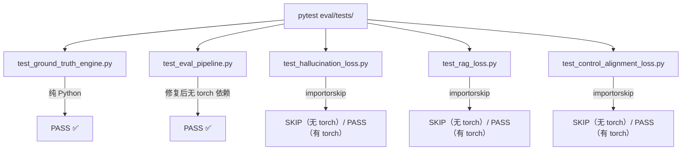

# 技术方案: Tri-Transformer Eval 工程 Bug 修复与完善

**任务 ID**: backend-server-eval  
**平台**: Backend/Python  
**风险等级**: LOW  

## 背景与目标

eval/ 工程骨架代码已完整，存在 5 类 Bug/缺失导致 25 项测试中 4 项 ERROR。目标是修复 Bug、补全导出，使所有测试在无 torch 环境下 PASS 或 SKIP（0 ERROR）。

## 不做的事

- 不修改任何算法实现（token overlap、BLEU/ROUGE 等）
- 不为 eval 添加新功能
- 不引入新依赖

## 核心问题与解决思路

### 问题 1：RAGEvaluator torch 依赖污染（B1）

**根因**：`from eval.loss.hallucination_loss import FactualHallucinationLoss` 触发 torch import，但 RAGEvaluator 是 pipeline 层，不应依赖 torch。

**方案**：在 RAGEvaluator 内内联 `_compute_factual_support`（纯 Python token overlap），删除外部 import。

```
Before: rag_evaluator.py → hallucination_loss.py → torch ❌
After:  rag_evaluator.py（内联实现，无 torch 依赖）✅
```

### 问题 2：CIGate 阈值方向 Bug（B2）

**根因**：`recall_5 <= threshold` 将 recall==threshold 也判为 FAIL，语义错误。

**方案**：改为 `recall_5 < threshold`（recall 低于阈值才 FAIL）。

### 问题 3：EvalPipeline 不完整（B3）

**根因**：`run()` 中未调用 ControlEvaluator 和 DialogCohesionEvaluator。

**方案**：
- 为 `run()` 增加可选参数 `dialog_sessions: Optional[List[List[Dict]]] = None`
- 调用 `ctrl_evaluator.evaluate()` 并合并结果
- 若 `dialog_sessions` 不为 None 则调用 `dialog_evaluator.evaluate()`

### 问题 4：__init__.py 导出缺失（B5/B6）

**方案**：补全 `eval/loss/__init__.py` 和 `eval/pipeline/__init__.py` 导出所有公共类。

### 问题 5：torch 测试缺少 skip 机制（B7）

**方案**：在每个涉及 torch 的 test class 内添加：
```python
torch = pytest.importorskip("torch")
```

## 方案流程图



## 文件改动清单

| 文件 | 动作 | 描述 |
|------|------|------|
| `eval/pipeline/rag_evaluator.py` | modify | 移除 torch import，内联 token overlap |
| `eval/pipeline/ci_gate.py` | modify | `<=` 改为 `<` |
| `eval/pipeline/eval_pipeline.py` | modify | 集成 ControlEvaluator + DialogEvaluator |
| `eval/loss/__init__.py` | modify | 补全导出 |
| `eval/pipeline/__init__.py` | modify | 补全导出 |
| `eval/tests/test_hallucination_loss.py` | modify | importorskip |
| `eval/tests/test_rag_loss.py` | modify | importorskip |
| `eval/tests/test_control_alignment_loss.py` | modify | importorskip |
| `eval/tests/test_eval_pipeline.py` | modify | 修复 + 添加集成测试 |

## 验收标准

1. `pytest eval/tests/` 在无 torch 环境下：0 ERROR，只有 PASS 和 SKIP
2. `RAGEvaluator` 可在无 torch 环境 import 和运行
3. `CIGate`: recall_at_5=0.90, threshold=0.90 → PASS
4. `CIGate`: recall_at_5=0.89, threshold=0.90 → FAIL
5. `EvalPipeline.run()` 返回包含 `instruction_following_rate` 字段
6. `from eval.loss import HallucinationLoss` 可用
7. `from eval.pipeline import EvalPipeline` 可用

## 风险评估

| 风险 | 概率 | 影响 | 缓解 |
|------|------|------|------|
| RAGEvaluator 内联逻辑与原始实现不一致 | 低 | 中 | 逐字复制算法，无修改 |
| 集成测试与现有测试数据冲突 | 低 | 低 | 使用独立 mock 数据 |
