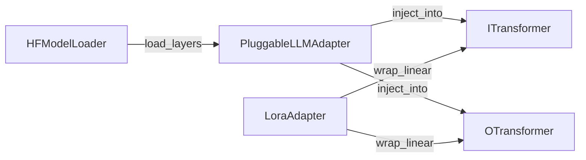
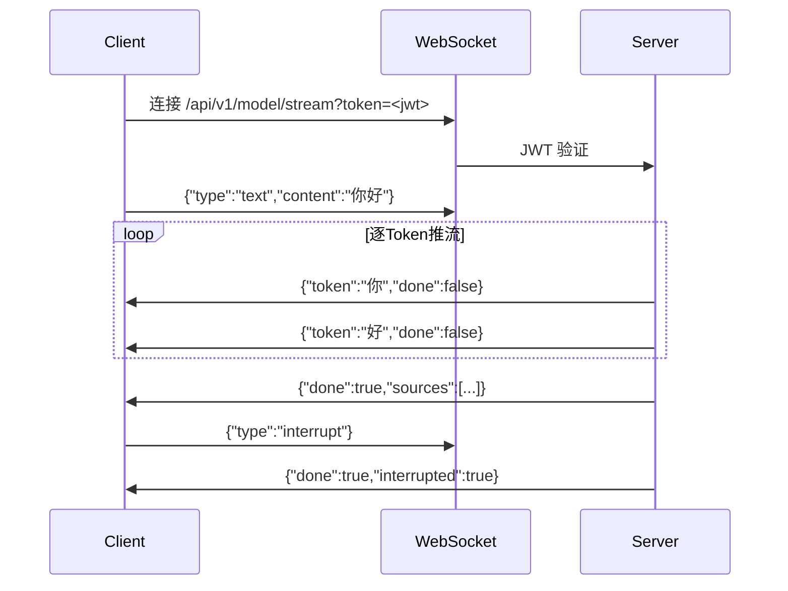

# 技术方案 — Tri-Transformer 后端增量开发 v2

**任务 ID**: tri-transformer-backend-v2
**创建时间**: 2026-03-27

---

## 1. 背景与目标

在已有 FastAPI 后端（80 tests passing，覆盖率 76%）基础上，按最新 sub_prds 01~04 增量实现 4 个核心模块，使后端服务向完整 Tri-Transformer 架构演进。

**本期不做**：前端 WebRTC、真实 GPU 训练、Docker 部署、真实 SNAC/VQ-GAN 集成。

---

## 2. 模块设计

### 2.1 双端大模型插拔（FR-101）



**核心类**：
- `HFModelLoader.load(model_id, num_layers)` → 返回 `nn.ModuleList`（截取前 N 层 Transformer 层）
- `PluggableLLMAdapter(branch, external_layers)` → 替换分支的 Decoder/Encoder 层
- `LoraAdapter(linear, rank=8)` → 在 `nn.Linear` 外包装低秩旁路

**LoRA 数学**：
```
W_new(x) = W(x) + B @ A @ x
A: R^{rank × in_features}（正态初始化）
B: R^{out_features × rank}（零初始化）
```
初始时 B=0 确保 LoRA 等价于原始权重，训练时仅 A、B 参数有梯度。

---

### 2.2 多模态统一 Tokenizer（FR-102）

**Token ID 空间分配**：
| 模态 | 范围 | 特殊 Token |
|------|------|-----------|
| 文本 | 0 ~ 127999 | `<pad>`, `<bos>`, `<eos>` |
| 音频 | 130000 ~ 134000 | `<\|audio_start\|>` |
| 视觉 | 135000 ~ 145000 | `<\|vision_start\|>` |
| 控制 | 129900 ~ 129999 | `<\|interrupt\|>` |

**混合编码流程**：
```
UnifiedTokenizer.encode_mixed(inputs: list[ModalInput]) → list[int]
  - 每段 ModalInput 前插入对应模态的 start token
  - 各模态 tokenizer 输出 ID 偏移到对应区间
  - 合并为单一 input_ids 序列
```

---

### 2.3 流式推理 WebSocket 端点（FR-103）



**鉴权**：WebSocket Upgrade 阶段不支持 Authorization header，通过 `?token=<jwt>` query param。

**StreamingEngine**：
- `generate(query, context, history)` → `AsyncGenerator[str, None]`
- Mock 模式：将预设回复字符串按字符逐 Token 推送，每 Token 间 `await asyncio.sleep(0.01)`
- 支持 `interrupt_event: asyncio.Event`，设置后生成器立即 `return`

---

### 2.4 幻觉阻断服务（FR-104）

```
FactChecker.check(generated: str, contexts: list[str]) -> FactCheckResult
  1. 对 generated 和每个 context 生成 embedding（Mock: 缓存的随机向量，相同文本返回相同向量）
  2. 计算 generated 与 contexts 最大余弦相似度
  3. score < threshold(0.3) → hallucination_detected=True
```

**对话链路集成**：
```
chat_service.send_message()
  → inference_svc.infer() → result
  → fact_checker.check(result["text"], context_texts) → fact_result
  → 写入 assistant_msg.hallucination_detected = fact_result.hallucination_detected
  → 响应中包含 hallucination_detected 字段
```

---

## 3. 文件变更清单

| 文件 | 操作 | 说明 |
|------|------|------|
| `backend/app/model/lora_adapter.py` | 新增 | LoraAdapter |
| `backend/app/model/pluggable_llm.py` | 新增 | HFModelLoader + PluggableLLMAdapter |
| `backend/app/model/tokenizer/__init__.py` | 新增 | 包初始化 |
| `backend/app/model/tokenizer/text_tokenizer.py` | 新增 | TextTokenizer |
| `backend/app/model/tokenizer/audio_tokenizer.py` | 新增 | AudioTokenizer |
| `backend/app/model/tokenizer/vision_tokenizer.py` | 新增 | VisionTokenizer |
| `backend/app/model/tokenizer/unified_tokenizer.py` | 新增 | UnifiedTokenizer |
| `backend/app/services/model/stream_engine.py` | 新增 | StreamingEngine |
| `backend/app/api/v1/stream.py` | 新增 | WebSocket 路由 |
| `backend/app/main.py` | 修改 | 注册 stream router |
| `backend/app/services/model/fact_checker.py` | 新增 | FactChecker |
| `backend/app/schemas/chat.py` | 修改 | 新增 hallucination_detected 字段 |
| `backend/app/services/chat/chat_service.py` | 修改 | 集成 FactChecker |
| `backend/app/models/chat_session.py` | 修改 | ChatMessage 新增列 |
| `backend/tests/test_pluggable_llm.py` | 新增 | 插拔系统测试 |
| `backend/tests/test_tokenizer.py` | 新增 | Tokenizer 测试 |
| `backend/tests/test_stream.py` | 新增 | WebSocket 流式测试 |
| `backend/tests/test_fact_checker.py` | 新增 | 幻觉阻断测试 |

---

## 4. 风险与缓解

| 风险 | 级别 | 缓解方案 |
|------|------|---------|
| peft 未在 requirements.txt | MEDIUM | 新增依赖，使用小型 Mock 模型测试 |
| WebSocket 测试复杂 | MEDIUM | 使用 Starlette TestClient.websocket_connect() |
| ChatMessage 新增列破坏测试 | LOW | hallucination_detected 默认 False，向后兼容 |
