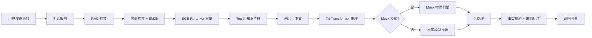
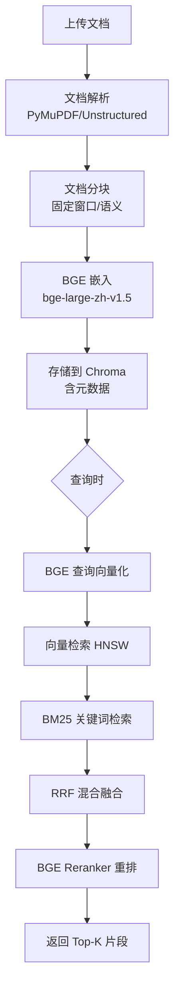

# Tri-Transformer 后端服务技术方案

**任务 ID**: tri-transformer-backend
**平台**: Python / FastAPI (Backend)
**创建时间**: 2026-03-27

---

## 1. 背景与目标

**背景**：Tri-Transformer 系统需要一套高性能后端服务，作为 RAG 知识库引擎、三分支模型推理调度中枢与对话管理核心，为前端及第三方客户端提供 RESTful API。

**目标**：
- 构建标准化 FastAPI 服务，提供完整的 RAG 文档处理与检索链路
- 提供多轮对话 API，串联 RAG 检索 + Tri-Transformer 推理完整链路
- 支持 JWT 多租户认证，确保知识库数据隔离
- 支持无 GPU 环境的 Mock 推理模式，便于开发测试

## 2. 范围

**包含**：
- FastAPI 应用骨架（路由/中间件/依赖注入）
- RAG 引擎（文档摄入/分块/BGE 嵌入/Chroma 存储/混合检索/重排）
- 对话管理服务（会话 CRUD/多轮消息/历史查询）
- 知识库管理 API（文档 CRUD/多租户隔离）
- Tri-Transformer 推理接口（含 Mock 模式）
- 用户认证（JWT 注册/登录）
- 训练调度 API（异步任务提交/状态查询）
- 事实一致性后处理

**不包含**：前端界面、模型训练本身、K8s 部署

## 3. 核心设计

### 3.1 项目目录结构

```
backend/
├── app/
│   ├── main.py                  # FastAPI 应用入口，注册路由与中间件
│   ├── core/
│   │   ├── config.py            # Pydantic Settings 配置管理
│   │   ├── database.py          # SQLAlchemy async 引擎
│   │   └── security.py          # JWT 工具（jose）
│   ├── api/
│   │   └── v1/
│   │       ├── __init__.py
│   │       ├── auth.py          # 认证路由 /auth
│   │       ├── chat.py          # 对话路由 /chat
│   │       ├── knowledge.py     # 知识库路由 /knowledge
│   │       ├── model.py         # 推理路由 /model
│   │       └── train.py         # 训练调度路由 /train
│   ├── models/
│   │   ├── user.py              # User ORM 模型
│   │   ├── document.py          # Document ORM 模型
│   │   ├── chat_session.py      # ChatSession ORM 模型
│   │   └── train_job.py         # TrainJob ORM 模型
│   ├── schemas/
│   │   ├── auth.py              # 认证请求/响应 Pydantic Schema
│   │   ├── chat.py              # 对话 Schema
│   │   ├── knowledge.py         # 知识库 Schema
│   │   ├── model.py             # 推理 Schema
│   │   └── train.py             # 训练任务 Schema
│   ├── services/
│   │   ├── rag/
│   │   │   ├── document_processor.py  # 文档解析与分块
│   │   │   ├── embedder.py            # BGE 嵌入服务
│   │   │   ├── vector_store.py        # Chroma 向量存储
│   │   │   ├── retriever.py           # 混合检索（向量+BM25）
│   │   │   └── reranker.py            # BGE Reranker 重排
│   │   ├── chat/
│   │   │   └── chat_service.py        # 对话编排（RAG+推理链路）
│   │   ├── model/
│   │   │   ├── inference_service.py   # 推理服务接口
│   │   │   └── mock_inference.py      # Mock 推理实现
│   │   └── train/
│   │       └── train_service.py       # 训练调度服务
│   └── dependencies.py          # FastAPI 依赖注入（current_user 等）
├── tests/
│   ├── conftest.py              # pytest fixtures
│   ├── test_auth.py
│   ├── test_chat.py
│   ├── test_knowledge.py
│   ├── test_rag.py
│   ├── test_model.py
│   └── test_train.py
├── alembic/                     # 数据库迁移
├── requirements.txt
├── pyproject.toml               # pytest 配置
├── .env.example
└── README.md
```

### 3.2 推理流程（完整链路）



### 3.3 RAG 流水线



## 4. 关键 API 设计

| 方法 | 路径 | 描述 |
|------|------|------|
| POST | /api/v1/auth/register | 用户注册 |
| POST | /api/v1/auth/login | 登录获取 JWT |
| POST | /api/v1/knowledge/documents | 上传文档（触发异步处理） |
| GET  | /api/v1/knowledge/documents | 文档列表（按 kb_id 隔离） |
| DELETE | /api/v1/knowledge/documents/{id} | 删除文档及向量 |
| GET  | /api/v1/knowledge/search | 检索测试 |
| POST | /api/v1/chat/sessions | 创建会话 |
| POST | /api/v1/chat/sessions/{id}/messages | 发送消息（完整链路） |
| GET  | /api/v1/chat/sessions/{id}/history | 获取对话历史 |
| POST | /api/v1/model/inference | 直接推理接口 |
| POST | /api/v1/train/jobs | 提交训练任务 |
| GET  | /api/v1/train/jobs/{id} | 查询训练状态 |
| DELETE | /api/v1/train/jobs/{id} | 取消训练任务 |

## 5. 风险与应对

| 风险 | 级别 | 应对 |
|------|------|------|
| BGE 模型文件过大（~1.3GB） | HIGH | 支持环境变量配置模型路径，Mock 模式不加载模型 |
| Tri-Transformer 无 GPU 可用 | HIGH | Mock 推理模式（MOCK_INFERENCE=true），返回模拟响应 |
| Chroma 向量存储性能瓶颈 | MEDIUM | 设计存储层接口，支持后续替换为 Milvus |
| 文档处理阻塞主线程 | MEDIUM | 使用 FastAPI BackgroundTasks 异步处理 |
| 多租户数据隔离不彻底 | HIGH | 所有查询强制附加 kb_id 过滤条件 |

## 6. 验收标准

- 所有 API 端点返回 HTTP 2xx（正常路径）
- JWT 认证保护路由，未授权返回 401
- 文档上传后可通过 /knowledge/search 检索到相关内容
- 对话接口返回包含知识来源引用
- Mock 模式下无需 GPU 即可完成对话
- pytest 测试覆盖率 ≥ 80%
- 单元测试全部通过（pytest -v）
