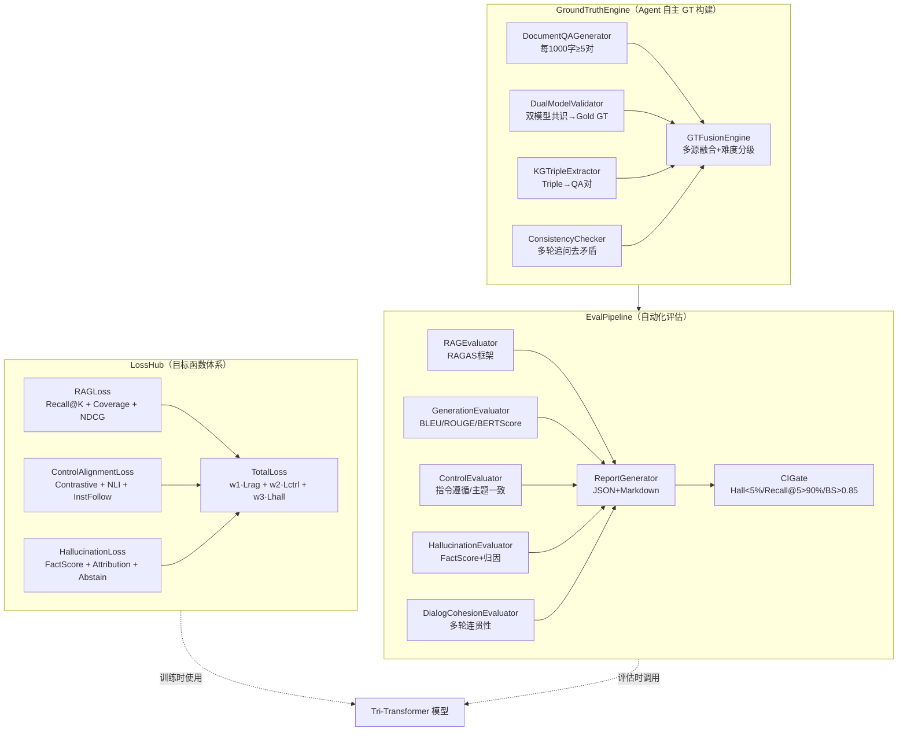

# 技术方案：Tri-Transformer 目标函数与验证体系

## 1. 背景与目标

### 1.1 背景
Tri-Transformer RAG 系统具备三分支架构（I-编码 / C-控制 / O-解码），但缺乏系统性的目标函数定义与可量化验证体系。本方案设计：
- **目标函数体系**（LossHub）：覆盖 RAG 检索、C 分支控制对齐、幻觉抑制三类核心损失
- **Agent 自主 Ground Truth 引擎**（GroundTruthEngine）：四条路径自动构建评估数据集
- **自动化 Evaluation Pipeline**（EvalPipeline）：端到端量化验证，集成 CI Gate

### 1.2 不做的事
- 不实现 Tri-Transformer 模型本体（由 tri-transformer-backend 负责）
- 不实现前端 Dashboard（评估结果通过 Markdown 报告输出）
- 不修改现有 RAG 检索逻辑（仅调用接口评估）

---

## 2. 核心架构设计



---

## 3. 目标函数详细设计

### 3.1 RAG 检索质量目标函数

**公式**：`L_rag = α·L_recall + β·L_coverage + γ·L_ndcg`

| 子损失 | 实现方法 | 梯度处理 |
|--------|---------|---------|
| `L_recall` | Recall@K（K=1,3,5,10），soft 版本通过 top-k softmax 近似 | 可微分 |
| `L_coverage` | F1-Token Overlap + BERTScore 加权混合 | BERTScore 部分用 detach 截断 |
| `L_ndcg` | LambdaNDCG / ApproxNDCG 可微分实现 | 可微分 |

### 3.2 C 分支控制对齐损失

**公式**：`L_ctrl = λ₁·L_contrastive + λ₂·L_nli + λ₃·L_inst`

| 子损失 | 实现方法 | 说明 |
|--------|---------|------|
| `L_contrastive` | InfoNCE / NT-Xent，正样本=遵循控制信号的生成 | 对比学习 |
| `L_nli` | DeBERTa-NLI 模型，蕴含→0损失，矛盾→高损失 | 知识一致性 |
| `L_inst` | 分类头（BCE）：是否遵循指令；回归头（MSE）：遵循程度 | 双形式 |

**控制信号对齐说明**：
- C 分支输出控制向量 `c`，正样本对 `(c, y_pos)` 中 y_pos 是遵循控制的生成
- 负样本对 `(c, y_neg)` 中 y_neg 是违反控制的生成（对抗采样）
- InfoNCE 最大化正样本相似度，最小化负样本相似度

### 3.3 幻觉抑制损失

**公式**：`L_hall = μ₁·L_fact + μ₂·L_attr + μ₃·L_abstain`

| 子损失 | 实现方法 | 说明 |
|--------|---------|------|
| `L_fact` | FactScore：将生成分解为原子事实，逐一验证 | 事实幻觉 |
| `L_attr` | Attention Weight 分析，归因到具体文档片段 | 来源归因 |
| `L_abstain` | 置信度 BCE：知识库无相关内容时应输出拒答 | 拒答校准 |

---

## 4. Agent Ground Truth 构建设计

### 4.1 四条路径说明

```
文档库
  ├─ Path 1: DocumentQAGenerator
  │    └─ LLM生成问题 → LLM生成答案 → 质量过滤 → Silver/Gold GT
  │
  ├─ Path 2: DualModelValidator  
  │    └─ 模型A回答 + 模型B回答 → BGE相似度 ≥0.85 → Gold GT
  │
  ├─ Path 3: KGTripleExtractor
  │    └─ spaCy NER + RE → (S,P,O) Triple → 转QA对 → Silver GT
  │
  └─ Path 4: ConsistencyChecker（后处理过滤）
       └─ 多轮追问 → NLI自洽性验证 → 过滤矛盾 → 提升质量
```

### 4.2 Ground Truth Schema

```python
class GroundTruthItem(BaseModel):
    id: str
    query: str
    answer: str
    source_docs: List[str]       # 来源文档片段 ID
    difficulty: Literal["easy", "medium", "hard"]
    quality_score: float          # 0.0 ~ 1.0
    source_type: SourceType       # DOCUMENT_QA / DUAL_MODEL / KG_TRIPLE / HUMAN
    metadata: Dict[str, Any]
```

### 4.3 质量与难度分级标准

| 难度 | 判断标准 |
|------|---------|
| Easy | 单文档单句可回答，答案直接出现在文档中 |
| Medium | 需要跨句或跨段落推理，答案需要整合 |
| Hard | 需要多文档推理，或需要因果/时序逻辑 |

---

## 5. Evaluation Pipeline 设计

### 5.1 指标体系

| 维度 | 指标 | 工具 | CI Gate 阈值 |
|------|------|------|------------|
| RAG 质量 | Faithfulness, Answer Relevancy, Context Recall | RAGAS | Recall@5 > 0.90 |
| 生成质量 | BLEU-4, ROUGE-L, BERTScore F1, METEOR | HF evaluate | BERTScore F1 > 0.85 |
| 控制性 | 指令遵循率, 主题一致性 | 自研 | - |
| 幻觉率 | Hallucination Rate | FactScore + 自研 | < 0.05 |
| 对话连贯 | 多轮一致性, 上下文保持率 | 自研 | - |

### 5.2 Bootstrap 置信区间

每个指标通过 Bootstrap Sampling（n=1000）计算 95% 置信区间，确保评估结果统计可靠。

### 5.3 CI Gate 逻辑

```python
def check_ci_gate(report: EvalReport) -> Tuple[bool, str]:
    failures = []
    if report.hallucination_rate >= 0.05:
        failures.append(f"Hallucination Rate {report.hallucination_rate:.3f} >= 0.05")
    if report.rag_recall_at_5 <= 0.90:
        failures.append(f"RAG Recall@5 {report.rag_recall_at_5:.3f} <= 0.90")
    if report.bert_score_f1 <= 0.85:
        failures.append(f"BERTScore F1 {report.bert_score_f1:.3f} <= 0.85")
    return len(failures) == 0, "\n".join(failures)
```

---

## 6. 目录结构

```
eval/
├── requirements.txt
├── pyproject.toml
├── config.yaml
├── loss/
│   ├── __init__.py
│   ├── base.py
│   ├── rag_loss.py
│   ├── control_alignment_loss.py
│   ├── hallucination_loss.py
│   └── total_loss.py
├── ground_truth/
│   ├── __init__.py
│   ├── schema.py
│   ├── document_qa_generator.py
│   ├── dual_model_validator.py
│   ├── kg_triple_extractor.py
│   ├── consistency_checker.py
│   ├── fusion_engine.py
│   └── gt_versioning.py
├── pipeline/
│   ├── __init__.py
│   ├── rag_evaluator.py
│   ├── generation_evaluator.py
│   ├── control_evaluator.py
│   ├── hallucination_evaluator.py
│   ├── dialog_evaluator.py
│   ├── eval_pipeline.py
│   ├── ci_gate.py
│   └── report_generator.py
├── scripts/
│   ├── build_ground_truth.py
│   ├── run_eval.py
│   └── ci_check.py
├── tests/
│   ├── test_rag_loss.py
│   ├── test_control_alignment_loss.py
│   ├── test_hallucination_loss.py
│   ├── test_ground_truth_engine.py
│   └── test_eval_pipeline.py
├── data/
│   └── gt_versions/
└── docker/
    ├── Dockerfile
    └── docker-compose.yml
```

---

## 7. 风险与缓解

| 风险 | 等级 | 缓解措施 |
|------|------|---------|
| 本地 LLM 生成 QA 质量不稳定 | Medium | 双模型交叉验证 + 质量分 ≥ 0.7 过滤 |
| DeBERTa-NLI 中文支持有限 | Medium | 使用多语言版本，降级时用 BGE 相似度 |
| RAGAS 版本兼容性 | Low | requirements.txt 锁定版本 |
| CPU-only BERTScore 慢 | Low | 批处理 + rescale_with_baseline 加速 |

---

## 8. 验收标准

| # | 标准 | 测试命令 |
|---|------|---------|
| AC-01 | GT 自动构建 ≥ 50 条（10 文档块） | `pytest eval/tests/test_ground_truth_engine.py` |
| AC-02 | RAGLoss backward 不报错 | `pytest eval/tests/test_rag_loss.py::test_rag_loss_differentiable` |
| AC-03 | 控制对齐损失方向正确 | `pytest eval/tests/test_control_alignment_loss.py` |
| AC-04 | 幻觉损失差异 > 0.1 | `pytest eval/tests/test_hallucination_loss.py` |
| AC-05 | EvalPipeline 一键运行 | `pytest eval/tests/test_eval_pipeline.py` |
| AC-06 | CI Gate exit 0/1 | `pytest eval/tests/test_eval_pipeline.py::test_ci_gate_*` |
