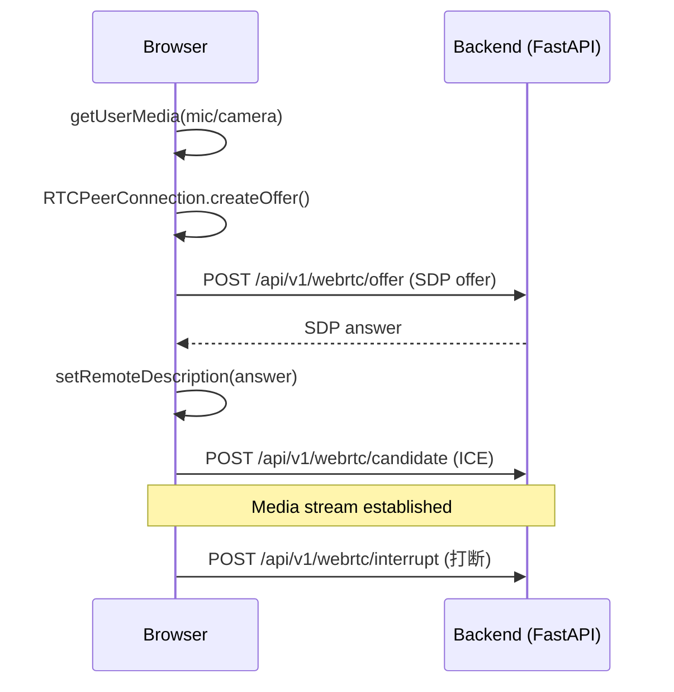

# 技术方案 - Tri-Transformer 前端 v2

## 背景与目标

在 v1（54 测试全绿，文本对话 + 文档管理 + 指标监控）基础上，按 `sub_prd_04` 要求新增：

1. **WebRTC 全双工音视频交互**：浏览器麦克风/摄像头 → Tri-Transformer 实时音视频流
2. **训练配置平台化**：大模型插件选择（HuggingFace Model ID）+ 超参配置 + 训练启动

## 核心设计

### 1. WebRTC 信令流程



### 2. WebRTC 状态机（webrtcStore）

```
idle
  → [startCall()] → requesting_media
requesting_media
  → [getUserMedia 成功] → connecting
  → [任意异常] → error
connecting
  → [ontrack] → connected
  → [任意异常] → error
connected
  → [endCall()] → disconnected
  → [oniceconnectionstatechange=disconnected] → disconnected
disconnected/error
  → [reset()] → idle
```

### 3. ChatPage 模态切换设计

现有 ChatPage 结构不变，在顶部加 Tab（Ant Design `Tabs`）：

```
ChatPage
  └── Tabs (text | audio | video)
       ├── text: 现有 MessageList + ChatInput（不改动）
       ├── audio: AudioVisualizer + WebRTCControls
       └── video: <video> 元素 + WebRTCControls
```

### 4. 训练配置流程

```
TrainingPage
  ├── ModelPluginSelector（选择 I 端/O 端底座模型）
  ├── TrainingConfigForm（超参：lr / batch_size / max_steps / phase）
  └── 启动后：轮询 GET /training/progress（5s interval）→ 更新 loss 曲线
```

## 文件改动（28 个文件）

| 类型 | 数量 | 文件 |
|------|------|------|
| 新增类型定义 | 2 | webrtc.ts, trainingConfig.ts |
| 新增 API | 2 | webrtc.ts, trainingConfig.ts |
| 新增 MSW Mock | 2 | handlers/webrtc.ts, handlers/trainingConfig.ts |
| 修改 server.ts | 1 | mocks/server.ts |
| 新增 Store | 2 | webrtcStore.ts, trainingConfigStore.ts |
| 新增组件 | 5 | ChatModeTabs, WebRTCControls, AudioVisualizer, ModelPluginSelector, TrainingConfigForm |
| 修改页面 | 2 | ChatPage.tsx, TrainingPage.tsx |
| 新增测试 | 8 | 8 个 __tests__ 文件 |

## 测试策略

### WebRTC Mock（jsdom 不支持原生 WebRTC）

```typescript
vi.stubGlobal('RTCPeerConnection', vi.fn().mockImplementation(() => ({
  createOffer: vi.fn().mockResolvedValue({ type: 'offer', sdp: 'mock_sdp' }),
  setLocalDescription: vi.fn().mockResolvedValue(undefined),
  setRemoteDescription: vi.fn().mockResolvedValue(undefined),
  addIceCandidate: vi.fn().mockResolvedValue(undefined),
  close: vi.fn(),
  onicecandidate: null,
  ontrack: null,
})));
```

### AudioContext Mock

```typescript
vi.stubGlobal('AudioContext', vi.fn().mockImplementation(() => ({
  createAnalyser: vi.fn().mockReturnValue({
    connect: vi.fn(), disconnect: vi.fn(),
    fftSize: 2048, getByteTimeDomainData: vi.fn(),
  }),
  createMediaStreamSource: vi.fn().mockReturnValue({ connect: vi.fn() }),
  close: vi.fn(),
})));
```

## 风险

| ID | 风险 | 缓解 |
|----|------|------|
| RISK-V2-001 | WebRTC jsdom 不完整 | vi.stubGlobal 完整 Mock |
| RISK-V2-002 | AudioContext 不支持 | vi.stubGlobal 完整 Mock |
| RISK-V2-003 | ChatPage 修改破坏 v1 测试 | 仅包 Tab 层，不改动现有子组件 |

## 验收标准

全量 vitest 通过（原 54 + 新增约 30+ 用例），TypeScript 0 错误。
