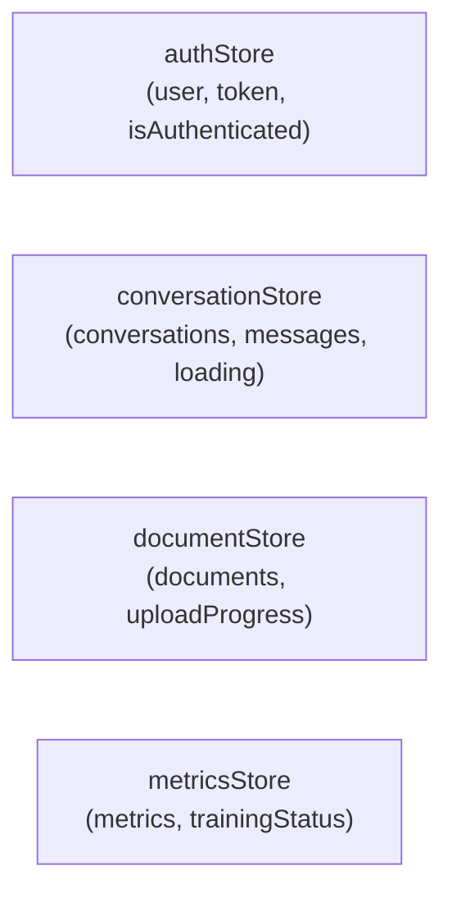
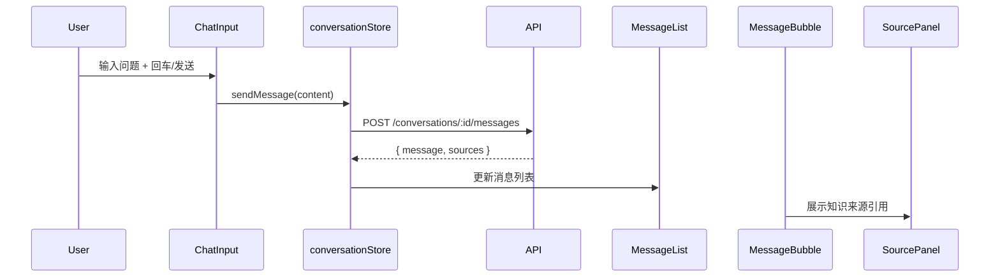
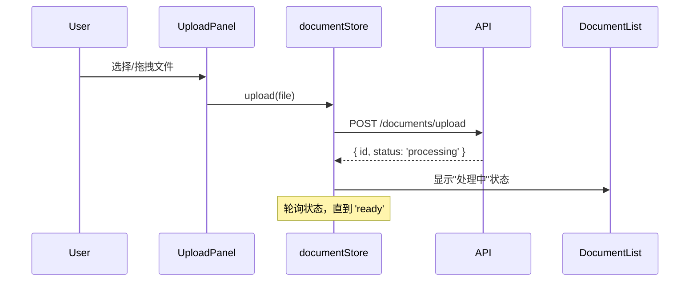

# 技术方案 - Tri-Transformer 前端

## 1. 背景与目标

为 Tri-Transformer 可控对话与 RAG 知识库增强系统构建 Web 前端，提供对话界面、知识库管理、训练监控与性能指标可视化能力。

**技术栈**：React 18 + TypeScript + Ant Design 5.x + Zustand + Vite

## 2. 范围

### 包含
- 用户认证（登录/注册/注销）
- 多轮对话界面（知识来源追溯、历史导出）
- 文档上传与提问
- RAG 知识库管理面板（上传/删除/检索测试）
- 训练状态监控
- 性能指标可视化仪表盘
- Docker 容器化部署

### 不包含
- 后端 API 实现
- Tri-Transformer 模型
- 移动端适配

## 3. 架构设计

### 3.1 项目结构

```
frontend/
├── src/
│   ├── pages/              # 路由级页面
│   ├── components/         # 业务组件
│   │   ├── chat/
│   │   ├── documents/
│   │   ├── metrics/
│   │   └── common/
│   ├── layouts/            # 布局组件
│   ├── store/              # Zustand Store
│   ├── api/                # Axios API 客户端
│   ├── hooks/              # 自定义 Hooks
│   ├── types/              # TypeScript 类型
│   ├── utils/              # 工具函数
│   └── mocks/              # MSW Mock handlers
├── Dockerfile
├── nginx.conf
└── package.json
```

### 3.2 路由设计

```
/login          → LoginPage（无需认证）
/register       → RegisterPage（无需认证）
/               → MainLayout（需认证）
  /chat         → ChatPage（默认）
  /documents    → DocumentsPage
  /training     → TrainingPage
  /metrics      → MetricsPage
```

### 3.3 状态管理



### 3.4 API 层设计

Axios 实例统一处理：
- 自动注入 `Authorization: Bearer {token}` 头
- 401 自动跳转登录页
- 网络错误统一提示

后端 API 未实现期间，使用 MSW（Mock Service Worker）拦截所有 API 请求，返回模拟数据。

## 4. 核心流程

### 4.1 对话流程



### 4.2 文档上传流程



## 5. 关键状态机

### 5.1 消息状态
```
IDLE → SENDING → SUCCESS
                → ERROR（重试）
```

### 5.2 文档状态
```
UPLOADING → PROCESSING → READY
                       → FAILED（可删除重传）
```

## 6. 技术风险与缓解

| 风险 | 缓解措施 |
|------|---------|
| 后端 API 未实现 | MSW Mock，契约对齐后直接切换 |
| 流式生成复杂度高 | MVP 用轮询，流式作 v2 |
| 首屏性能（图表 bundle） | MetricsPage lazy load，Recharts 按需引入 |

## 7. 待确认项

- 流式生成协议：SSE 还是 WebSocket？
- 认证 token 存储：localStorage vs httpOnly Cookie？
- 文档上传大小限制？

## 8. 验收标准

| AC | 测试命令 |
|----|---------|
| AC-001 多轮对话上下文 | `vitest run src/store/__tests__/conversationStore.test.ts` |
| AC-002 知识来源引用展示 | `vitest run src/components/chat/__tests__/MessageBubble.test.tsx` |
| AC-003 文件上传提问 | `vitest run src/components/documents/__tests__/UploadPanel.test.tsx` |
| AC-004 对话历史导出 | `vitest run src/utils/__tests__/exportConversation.test.ts` |
| AC-005 知识库文档管理 | `vitest run src/store/__tests__/documentStore.test.ts` |
| AC-009 用户认证 | `vitest run src/store/__tests__/authStore.test.ts` |

全量测试：`cd frontend && npm run test`
构建验证：`cd frontend && npm run build`
