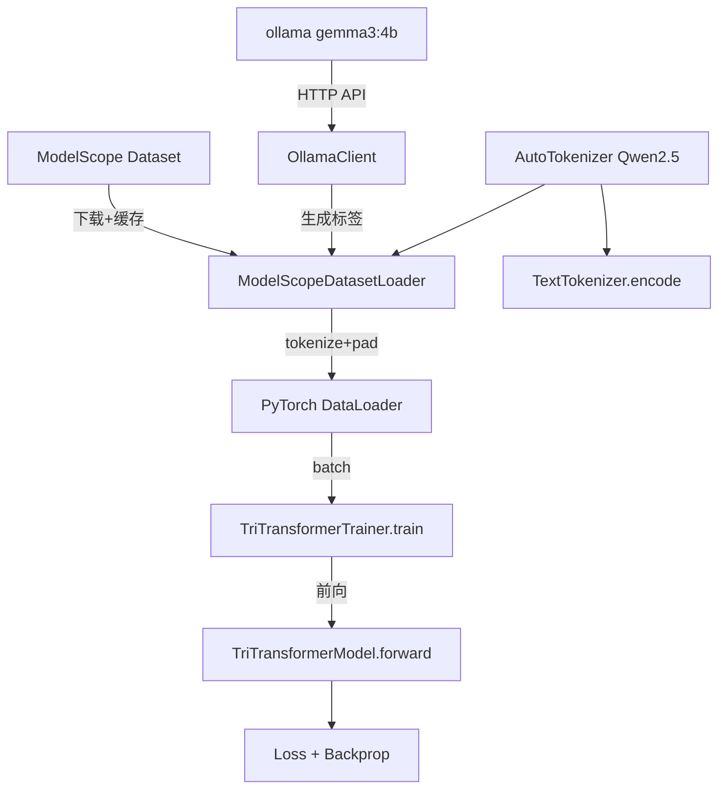

# 技术方案 - Tri-Transformer 模型训练流程实现

## 背景与目标

Tri-Transformer 三分支模型（ITransformer / CTransformer / OTransformer）已完整实现 Qwen3 风格 PyTorch 架构，但当前 `TriTransformerTrainer._make_dummy_batch()` 使用随机虚拟数据。本方案实现：

1. **ModelScope 数据集接入**：LCCC 中文对话、BELLE 中文指令数据
2. **ollama LLM 集成**：本地 `gemma3:4b` 用于数据增强
3. **BPE Tokenizer 升级**：Qwen2.5 词表（vocab_size=151936）
4. **训练入口脚本**：独立于 FastAPI 的命令行工具

## 不做

- 不变更 FastAPI train API 接口（保持向后兼容）
- 不修改 branches.py 核心架构
- 不涉及前端代码

## 发现的接口缺陷（必须修复）

**`tri_transformer.py` 与 `branches.py` 接口不匹配：**

```python
# ❌ 现有代码（tri_transformer.py:L95）
i_enc = self.i_branch(src, src_key_padding_mask=src_key_padding_mask)

# ✅ 修复（branches.py ITransformer 返回 tuple）
i_enc, _ = self.i_branch(src, src_key_padding_mask=src_key_padding_mask)

# ❌ 现有代码
ctrl_signal = self.c_branch(i_enc, o_prev=o_prev)

# ✅ 修复（CTransformer 返回 (ctrl_signal, adaln_i, adaln_o)）
ctrl_signal, _, _ = self.c_branch(i_enc, o_prev=o_prev)

# ❌ 现有代码
logits, o_hidden = self.o_branch(tgt, memory=i_enc, ...)

# ✅ 修复（OTransformer 返回 (logits, o_hidden, past)）
logits, o_hidden, _ = self.o_branch(tgt, memory=i_enc, ...)
```

## 核心设计

### 架构流程



### F1: ModelScopeDatasetLoader

```python
class ModelScopeDatasetLoader:
    def load(dataset_name: str, split: str = "train", max_samples: int = 50000) -> Dataset
    def get_dataloader(dataset, tokenizer, batch_size, max_len) -> DataLoader
```

- 支持 `lccc`（AI-ModelScope/LCCC-base-split）和 `belle`（BelleGroup/train_0.5M_CN）
- 单测使用 `unittest.mock` mock modelscope 下载，不依赖网络

### F3: OllamaClient

```python
class OllamaClient:
    def __init__(self, base_url="http://localhost:11434", model="gemma3:4b")
    def generate(prompt: str, **kwargs) -> str
    def list_models() -> list[str]
    def is_available() -> bool
```

- 通过 `requests.post` 调用 `http://localhost:11434/api/generate`
- `stream=False`，返回完整响应
- 单测使用 `unittest.mock.patch` 模拟 HTTP

### F6: TextTokenizer 升级

```python
class TextTokenizer:
    def __init__(self, model_name="Qwen/Qwen2.5-0.5B", offline=False)
    def encode(text: str, max_length=None, truncation=True) -> list[int]
    def decode(token_ids: list[int]) -> str
    @property
    def vocab_size(self) -> int  # 151936
```

- 首次调用自动下载到 `~/.cache/huggingface/hub/`
- 提供 `offline=True` 模式（使用本地 cache）

### F2: Trainer 集成 DataLoader

```python
def train(self, data_loader=None) -> list[dict]:
    for epoch in range(1, self.config.num_epochs + 1):
        if data_loader is not None:
            loss = self._train_epoch_with_loader(data_loader, epoch)
        else:
            loss = self.train_epoch(epoch)  # fallback 随机数据
```

- 保持 `train(data_loader=None)` 签名不变，向后兼容

## 文件变更清单

| 操作 | 文件 | 说明 |
|------|------|------|
| modify | `backend/app/model/tri_transformer.py` | 修复 forward() tuple 解包 |
| modify | `backend/app/model/tokenizer/text_tokenizer.py` | BPE tokenizer 升级 |
| modify | `backend/app/model/trainer.py` | DataLoader 集成 |
| add | `backend/app/services/train/dataset_loader.py` | ModelScope 数据集加载器 |
| add | `backend/app/services/model/ollama_client.py` | ollama HTTP 客户端 |
| add | `backend/scripts/install_deps.sh` | 依赖安装脚本 |
| add | `backend/scripts/train.py` | 命令行训练入口 |
| add | `backend/tests/test_dataset_loader.py` | DataLoader 单测 |
| add | `backend/tests/test_ollama_client.py` | OllamaClient 单测 |
| add | `backend/tests/test_text_tokenizer.py` | Tokenizer 单测 |
| add | `backend/tests/test_trainer_with_dataloader.py` | Trainer+DataLoader 集成测试 |
| add | `backend/tests/test_tri_transformer_forward.py` | forward() 接口修复测试 |

## 风险与缓解

| 风险 | 等级 | 缓解 |
|------|------|------|
| ModelScope 下载超时 | MEDIUM | 单测 mock；环境变量 MODELSCOPE_CACHE |
| Qwen2.5 tokenizer 需网络 | MEDIUM | 本地 cache 检测；offline 模式 |
| tri_transformer forward 回归 | LOW | 新增专项测试 |
| vocab_size 变更 | LOW | 无已保存 checkpoint，接受 |

## 验收标准

见 `tech-solution.yaml` → `validation.acceptance`（AC1-AC7）
